# ASD地板时光干预辅助系统

> 基于 LLM + Multi-Agent 的 ASD 儿童家庭干预辅助系统

---

## 一、项目概述

### 1.1 项目简介

为ASD（孤独症谱系障碍）儿童家庭打造的"随身治疗师"。系统通过LLM驱动的智能记录、时序知识图谱的发展追踪、Multi-Agent协同评估，结合 AR 增强现实技术，帮助家长在家庭场景中有效开展地板时光干预。

本系统将人工智能技术应用于ASD家庭干预的记录与分析环节。家长可以用自然语言描述孩子的日常表现，系统自动完成行为解析、数据结构化和趋势分析。通过持续记录和积累，系统帮助家长追踪孩子在较长时间跨度内的发展变化，将分散的观察记录整合为相对完整的成长档案，使微小的进步得以被记录和识别。

系统包含多个协同工作的功能模块：智能记录模块处理家长的输入并提取关键信息，兴趣分析模块识别孩子的兴趣偏好和变化趋势，发展评估模块追踪33个功能维度的表现并识别质变时刻，游戏推荐模块根据孩子的个体情况生成个性化的干预方案（包括传统游戏和 AR 增强游戏），对话助手则提供统一的自然语言交互入口。各模块通过精心设计的记忆共享层实现信息互通，为家长提供连贯的使用体验。

### 1.2 核心价值主张

让每一个ASD儿童家庭都能拥有专业级的干预记录与分析能力，将零散的日常观察转化为可追溯的发展轨迹，让"看不见的进步"被看见。

- **AI 驱动的细节捕捉与应用**：自动识别瞬时兴趣点和趋势变化，将每一次观察转化为下一次干预的优化依据
- **数据驱动的成长记录**：将口语化描述转化为结构化数据，既追踪量化指标的变化，更捕捉行为性质的质变时刻
- **专业知识的辅助应用**：内置地板时光理论框架，帮助家长将日常观察关联到专业概念，生成可操作的干预方案
- **医家协同的数据支持**：提供结构化报告，弥补门诊观察与家庭场景之间的信息断层
- **便捷的交互方式**：对话式界面，自然语言完成全部操作，随时可用

---

## 二、场景价值

### 2.1 项目来源

本项目是中国残疾人联合会与南京大学的合作项目，旨在利用人工智能技术解决 ASD 儿童家庭干预中的实际困难。项目依托南京大学的技术研发能力和中国残联的行业资源与专业背景，致力于为 ASD 儿童家庭提供智能化的干预辅助工具。

中国残联在全国范围内与大量 ASD 儿童家庭保持联系，深入了解家庭干预的真实需求和痛点。通过这一合作，项目能够获得真实用户的参与和反馈，在实际应用场景中持续验证和完善产品功能。残联的专业指导确保了系统设计符合 ASD 干预的专业要求，而真实用户的测试则保证了产品的实用性和有效性。

### 2.2 目标用户

- **核心用户**：ASD儿童的家长，需要在家庭环境中持续开展干预训练，记录孩子的日常表现，获取干预方案建议
- **延伸用户**：康复治疗师、特教老师，需要了解孩子在家庭中的真实表现，作为专业评估和治疗方案调整的参考

### 2.3 痛点分析

#### 痛点一：看不见的进步

ASD儿童的进步往往是微观的、渐进的。家长每天陪伴孩子，反而容易陷入"好像没什么变化"的困境。由于缺乏系统的记录和对比，家长难以量化和感知孩子的成长，容易产生挫败感和焦虑情绪。即使孩子在某些方面有所进步，也可能因为变化太细微而被忽略。

#### 痛点二：说不出的话

家长能够观察到孩子的行为表现，但往往缺乏专业的描述语言和分析框架。与治疗师沟通时，只能用"他今天好像开心一点"、"感觉比以前好些了"这类模糊的表述，难以提供准确、有效的信息。这种信息传递的不精确，影响了治疗师对孩子状况的判断和干预方案的调整。

#### 痛点三：找不到的兴趣

地板时光的核心理念是"跟随孩子的兴趣"，但很多兴趣点是隐藏的、转瞬即逝的，或者表现形式不明显。家长在日常互动中可能注意到孩子对某些事物的反应，但难以系统性地识别、记录和利用这些兴趣点作为干预素材。此外，孩子的兴趣可能随时间变化，家长也难以把握这种动态变化。

#### 痛点四：断掉的链条

医院或机构的专业评估与家庭的日常干预之间存在明显断层。治疗师主要依靠门诊时段的观察和家长的口头反馈来了解孩子情况，无法全面掌握家庭干预的真实开展情况和效果。另一方面，家长在接受专业建议后，往往不知道如何在家庭场景中具体落地执行，或者执行过程中遇到问题时缺乏及时的指导。这种医家之间的信息不对称和协同困难，影响了整体干预效果。

### 2.4 市场潜力与落地路径

根据相关统计数据，中国ASD儿童数量超过300万，且呈持续增长趋势。家庭干预是ASD儿童康复的重要组成部分，但专业资源（如康复治疗师、特教老师）相对稀缺，难以满足所有家庭的需求。这为辅助性的智能工具提供了广阔的应用空间。

作为中国残联与南京大学的合作项目，本系统具有明确的落地路径和应用前景。中国残联体系覆盖全国各级行政区域，拥有完善的服务网络和丰富的实践经验。通过这一合作平台，项目能够：

1. **获得真实用户反馈**：接触大量 ASD 儿童家庭，在实际使用场景中验证产品功能
2. **确保专业性**：在残联专业人员的指导下，确保系统设计符合 ASD 干预的专业标准
3. **实现规模化推广**：依托残联的服务网络，将成熟的产品推广到更多有需要的家庭
4. **持续优化迭代**：基于真实用户的使用数据和反馈，不断改进系统功能和用户体验

这种"产学研用"结合的模式，为项目的长期发展和社会价值实现提供了坚实基础。

### 2.5 系统用例图

系统的主要参与者包括家长、孩子、治疗师，以及系统的各个功能模块。下图展示了核心用例及其关系：

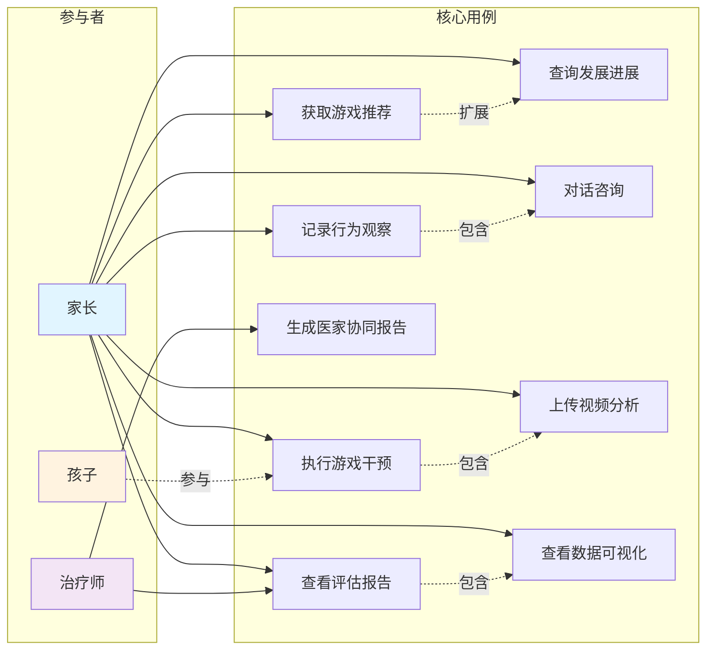

**用例说明**：
- 家长是系统的主要使用者，可以记录观察、查询进展、获取推荐、执行游戏、查看报告
- 孩子作为干预对象，参与游戏执行过程
- 治疗师通过医家协同报告了解孩子在家庭中的真实表现
- 对话咨询贯穿所有功能，提供统一的自然语言交互入口

---

## 三、产品功能

### 3.1 功能全景图

系统围绕"评估→推荐→实施→反馈→再评估"的核心循环，持续优化干预效果：

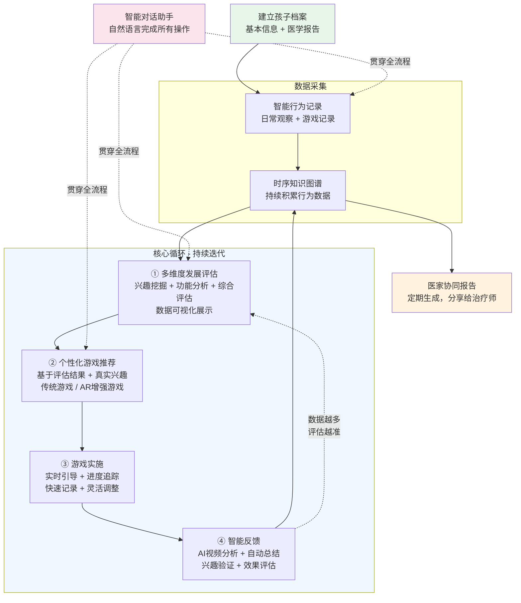

家长建立档案后，通过日常记录和游戏记录持续积累数据。系统自动分析生成评估报告和可视化图表，基于评估结果推荐个性化游戏。游戏执行过程中提供实时引导，结束后自动生成总结并优化下次推荐。定期生成医家协同报告，支持与治疗师的沟通。整个流程形成闭环，让系统对孩子的理解越来越深入，推荐越来越精准。

### 3.2 智能行为记录

系统的行为记录功能贯穿日常生活和游戏干预两大场景。在日常生活中，家长可以随时用文字或语音记录观察到的行为，比如"小明今天玩积木时，主动看我的眼睛，还笑了"。系统会自动将这些口语化的描述转化为结构化数据，提取出事件类型、涉及的对象、关联的兴趣维度和功能维度，并存入时序知识图谱。这样，每一次记录都不是孤立的数据点，而是与其他记录建立关联，形成孩子发展的完整轨迹。

在游戏过程中，系统提供了更便捷的记录方式。家长可以使用快速按钮，在游戏进行时一键记录关键时刻，比如孩子主动发起互动、出现眼神接触等，无需打断游戏流程。如果家长录制了游戏视频，系统还能通过 AI 视频分析自动识别孩子的关键行为，包括眼神接触的频率和持续时间、肢体动作、情绪变化等，并评估互动质量。这些数据会自动整合，生成游戏总结报告，包含参与度评分、目标达成度、亮点时刻和需要关注的地方。

所有记录最终都会存入时序知识图谱，这个图谱不仅记录"发生了什么"，更记录"什么时候发生"，支持后续的趋势分析和发展评估。家长不需要担心记录的专业性，系统会自动将日常观察转化为专业的结构化数据。

### 3.3 多维度发展评估

系统采用三个专业 AI Agent 协同工作的方式进行发展评估。第一个 Agent 专注于兴趣挖掘，它会分析孩子的行为记录和游戏表现，识别哪些是真实的兴趣，哪些只是家长的假设。对于持续出现的兴趣，系统会增强其权重；对于只出现一次就消失的兴趣，系统会降低其权重。这个 Agent 还特别关注游戏中的"意外时刻"，比如孩子对包装纸、背景音乐或光影变化的兴趣，这些往往比预设的兴趣点更能揭示孩子的真实偏好。同时，系统会评估兴趣的广度，如果发现孩子的兴趣过于狭窄，会提出扩展的方向。

第二个 Agent 负责功能分析，它评估孩子在各个发展维度的表现，但重点不是"做了多少次"，而是"做得怎么样"。系统关注四个方面的质变：主动性（从被动到主动）、持续性（从短暂到持久）、泛化性（从特定情境到多种情境）、复杂性（从简单到复杂）。比如，孩子以前需要家长引导才会拿玩具，现在会主动拿起来，这就是主动性的质变。系统不会强行分析所有维度，只关注有数据支持的活跃维度，并明确标注数据量和置信度。即使数据量少，系统也会给出初步判断，随着数据积累逐步提升评估精度。

第三个 Agent 整合前两个 Agent 的分析结果，生成家长友好的综合评估报告。报告采用"三明治"结构：先肯定孩子的进步和亮点，让家长感受到成长；然后客观指出需要关注的领域，使用中性词汇而非负面表述；最后提供具体可操作的建议，包括明确的步骤和方法。报告避免使用过多专业术语，而是用通俗易懂的语言，配合具体的例子和场景。建议不是空洞的"加强训练"，而是具体到"每天在吃饭时，尝试让孩子递碗筷，建立眼神接触"这样的可执行步骤。

三个 Agent 的协同工作确保了评估的全面性和专业性，同时保持了对家长的友好性。系统会将兴趣分析和功能分析结合起来，发现它们之间的关联，比如孩子对音乐有兴趣，而语言表达需要提升，那么建议就是设计音乐主题的语言互动游戏，用兴趣驱动功能发展。

**三Agent协同评估流程图**：

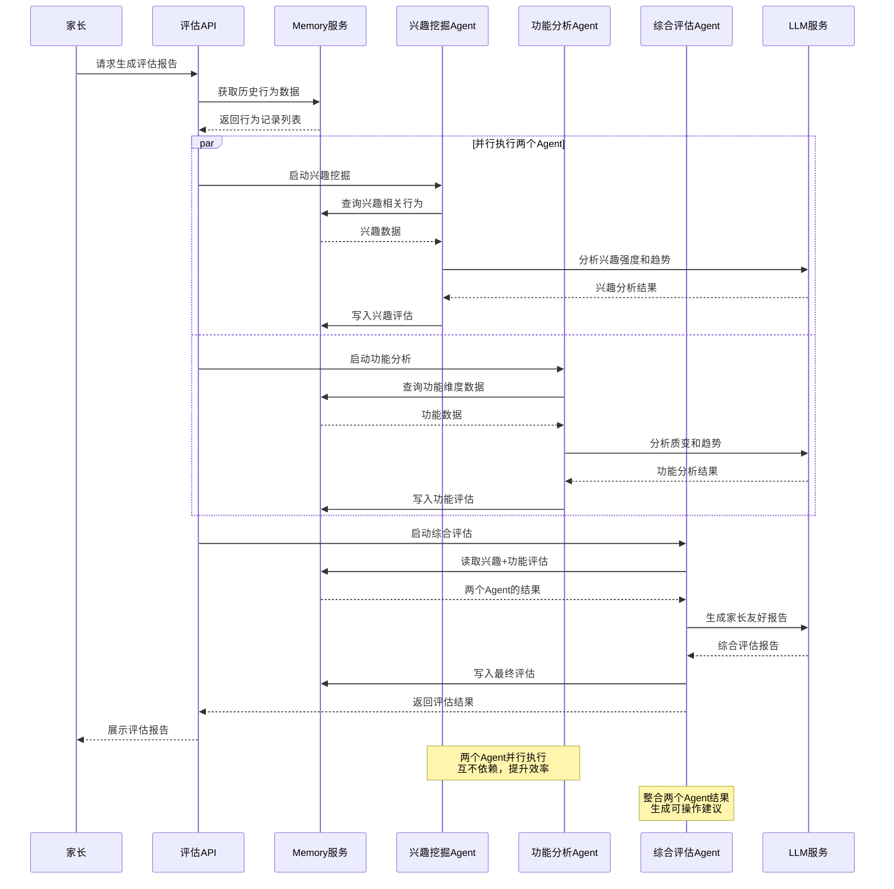

**流程特点**：
- 兴趣挖掘和功能分析并行执行，提升效率
- 三个Agent通过Memory服务共享数据，无需直接依赖
- 每个Agent专注自己的职责，输出结构化结果
- 综合评估Agent整合前两者，生成家长友好的报告

### 3.4 数据可视化

系统提供三种主要的可视化方式帮助家长直观理解孩子的发展状况。兴趣热力图用颜色深浅展示孩子在 8 个兴趣维度的强度分布，家长一眼就能看出孩子最近对哪些事物更感兴趣。点击任意维度，可以查看具体的证据和时间线，了解这个兴趣是如何发展的。

发展趋势图以时间序列的方式展示孩子在各功能维度的进步曲线，特别之处在于会标注关键的里程碑时刻，比如"2024-01-15：首次主动叫妈妈"、"2024-02-03：首次完成 3 步骤任务"。这些标注让家长能够清楚地看到孩子的成长轨迹，而不是感觉"好像没什么变化"。点击里程碑，还可以查看当时的详细记录和视频片段。

能力雷达图展示孩子在 33 个功能维度的整体表现，清晰呈现优势领域和需要关注的方面。家长可以选择显示同龄儿童的平均水平作为参考，帮助全面了解孩子的发展状况。点击任意维度，可以查看详细分析和改进建议。

所有可视化图表都支持交互式探索，家长可以拖动时间轴查看不同时期的变化，筛选特定维度或兴趣进行深入分析，也可以导出图表分享给治疗师或家人。

**数据可视化示意图**：

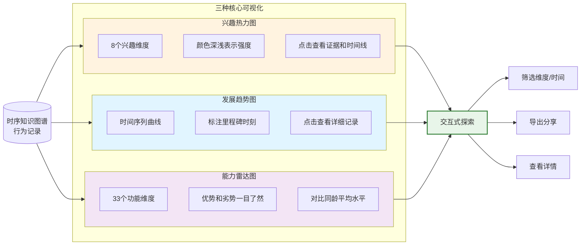

**可视化特点**：
- **兴趣热力图**：直观展示8个兴趣维度的强度分布
- **发展趋势图**：时间线展示进步曲线，标注关键里程碑
- **能力雷达图**：全面展示33个功能维度的表现
- **交互探索**：支持筛选、导出、查看详情

### 3.5 个性化游戏推荐

系统的游戏推荐引擎会综合考虑孩子的档案信息、近期评估结果和游戏历史，为每个孩子生成独一无二的干预方案。推荐过程首先会识别当前最需要关注的发展维度，提取已验证的真实兴趣点，分析历史游戏的成功模式和失败教训。然后使用检索增强生成技术，从游戏知识库中参考成功案例，结合孩子的具体情况设计游戏内容。

每个推荐的游戏方案都包含完整的信息。基本信息部分说明游戏的标题、简介、预计时长和目标维度。设计依据部分解释为什么推荐这个游戏，利用了哪些兴趣点，针对哪些发展目标，并提供趋势分析摘要作为数据支持。游戏步骤部分详细描述 3 到 8 个步骤，每个步骤都包含家长需要做的具体动作、期待孩子的反应、关键要点和小贴士。材料和环境部分列出所需材料清单、环境布置建议和安全注意事项。目标和标准部分明确主要目标和次要目标，以及可衡量的成功标准。

系统特别设计了兴趣验证机制。对于档案中标记但未验证的兴趣点，系统会设计验证性游戏。游戏总结时会明确标注该兴趣点是否得到验证。如果验证失败，系统会降低该兴趣点的权重，避免在后续游戏中重复使用；如果验证成功，则会增强权重，优先在后续游戏中使用。这样形成了"推荐 → 实施 → 总结 → 优化"的闭环，让每次游戏都能让下次推荐更精准。家长也可以指定推荐偏好，比如重点关注的维度或期望的游戏时长，系统会根据这些偏好调整推荐策略。

**游戏推荐流程图**：

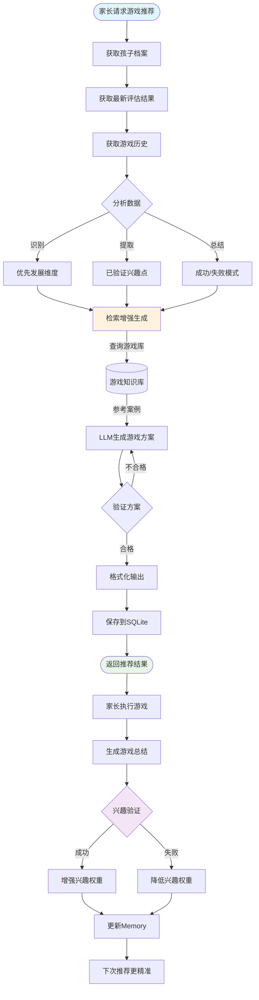

**流程特点**：
- 数据驱动：基于档案、评估、历史三重数据源
- RAG增强：从知识库检索成功案例，避免重复造轮子
- 闭环优化：通过兴趣验证机制持续优化推荐质量
- 个性化：每个孩子的推荐都是独一无二的

### 3.6 AR 增强地板游戏

系统将 AR 技术融入传统地板时光游戏，在真实环境中叠加虚拟元素。家长和孩子可以共同佩戴 VR 眼镜，进入同一个虚拟空间进行"3D 涂鸦"。在这个空间里，他们用手势在空中画画，创造立体的彩色线条。孩子画一条线，家长接着画，共同完成一个图案。这个过程自然地促进了眼神接触、共同注意力和社交互动。虚拟画笔可以变换颜色和形状，完成图案时会有烟花或音乐作为奖励。

AR 游戏不需要准备物理道具，可以在家庭任意空间开展。虚拟动物可以出现在客厅，孩子可以"喂食"、"抚摸"；虚拟音乐按钮可以让孩子通过触摸学习因果关系。每个 AR 游戏都基于孩子的真实兴趣和明确的干预目标设计，为家长和孩子创造一个新的互动空间。系统使用主流的 AR/VR 框架，数据在本地处理，保护隐私。


**AR增强游戏架构**：

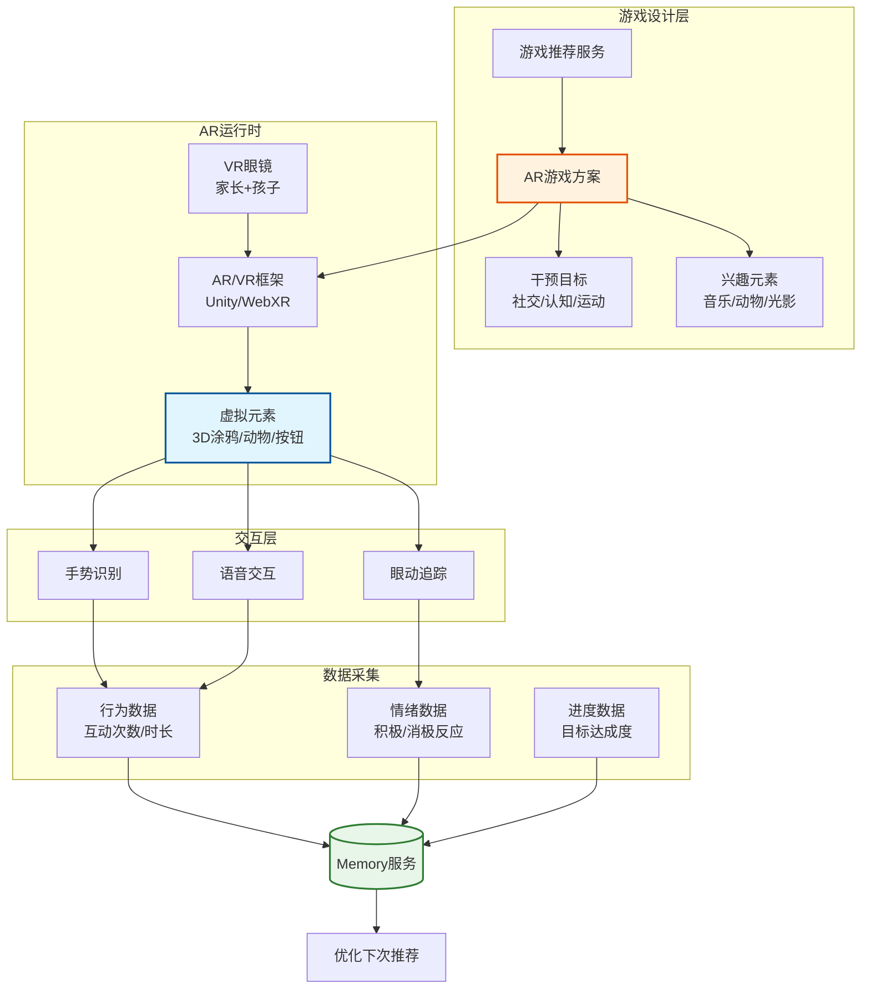

**AR游戏特点**：
- **无需物理道具**：虚拟元素在真实空间中呈现
- **共同参与**：家长和孩子同时进入虚拟空间
- **自然互动**：手势、语音、眼神多模态交互
- **数据闭环**：自动采集行为数据，优化后续推荐
- **隐私保护**：数据本地处理，不上传云端

### 3.7 实时游戏引导

在游戏执行过程中，系统提供实时的引导和支持。根据游戏方案，系统会按步骤显示当前应该做什么，提示每个步骤的关键要点和预计时长。在关键时刻会弹出提醒，比如"注意观察孩子的眼神"或安全注意事项。当孩子出现特定行为时，系统会提供应对建议，例如孩子注意力分散时如何重新吸引，孩子情绪激动时如何安抚。

系统实时显示游戏进度，包括已完成的步骤和剩余时间，支持快速按钮记录重要行为。家长可以根据实际情况灵活调整，跳过或重复某些步骤，随时暂停、继续或结束游戏。系统会记录实际执行情况，用于后续分析和优化。

### 3.8 AI 视频分析

系统集成多模态理解能力，可以分析游戏过程的视频，自动提取关键信息。系统会识别孩子的关键行为，包括眼神接触的频率和持续时间、肢体动作、物品操作方式、社交互动表现等。同时识别孩子的情绪状态，分析积极情绪、消极情绪和中性状态，以及情绪变化的时间点和触发因素。

系统还会评估家长-孩子互动的质量，包括互动回合数、响应时间、主动性和参与度。自动标记视频中的关键时刻，如突破性表现、亮点时刻和挑战时刻，生成时间戳和截图方便回顾。基于视频分析结果，系统自动生成游戏总结，包含整体评价、各维度表现、亮点和挑战、改进建议，总结内容自动存入时序记忆图谱。视频数据在本地处理，只提取结构化的分析结果，家长可以选择是否保存视频文件。

**AI视频分析流程图**：

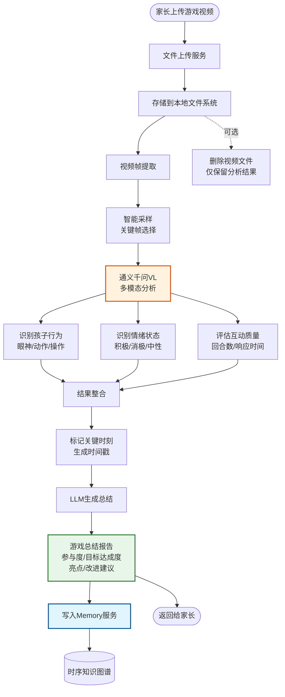

**流程特点**：
- 智能采样：不分析所有帧，只选择关键帧，提升效率
- 多维度分析：行为、情绪、互动质量并行识别
- 隐私保护：视频可选删除，只保留结构化分析结果
- 自动入库：分析结果自动存入知识图谱，用于后续评估

### 3.9 智能对话助手

系统提供基于 LLM Function Calling 的智能对话助手，家长通过自然语言即可完成所有操作。当家长描述孩子的行为时，系统自动调用记录工具；当家长询问孩子情况时，自动调用查询工具；当家长需要游戏建议时，自动调用推荐工具。

助手可以调用多种工具，包括记录行为、查询行为记录、查询兴趣点、查询维度进展、获取评估结果、获取游戏历史、推荐游戏、生成评估等。系统识别到行为描述时会立即记录，遇到问题时主动调用查询工具获取数据，基于数据回答问题而不是猜测，使用温暖、友好、专业的语气。助手支持流式输出，实时显示回复，工具调用时显示进度提示，提供良好的交互体验。

### 3.10 医家协同报告

系统将时序知识图谱中的数据转化为结构化报告，为治疗师提供孩子在家庭中的真实表现数据。报告按时间顺序展示孩子的行为记录，标注关键时刻和里程碑，显示发展趋势曲线。包含各维度的量化评分和变化趋势、兴趣点的分布和强度、游戏参与情况和效果统计。

报告提供多种趋势图表，包括发展趋势图、兴趣热力图和能力雷达图。使用专业术语描述孩子的表现，提供详细的证据和观察记录，标注数据来源和置信度。支持导出为 PDF 格式，可以通过邮件或打印分享给治疗师，保护隐私，只包含必要的信息。这些报告弥补了门诊观察与家庭场景之间的信息断层，为治疗师提供更全面的评估依据，支持治疗方案的动态调整，促进医家协同。

**医家协同报告生成流程**：

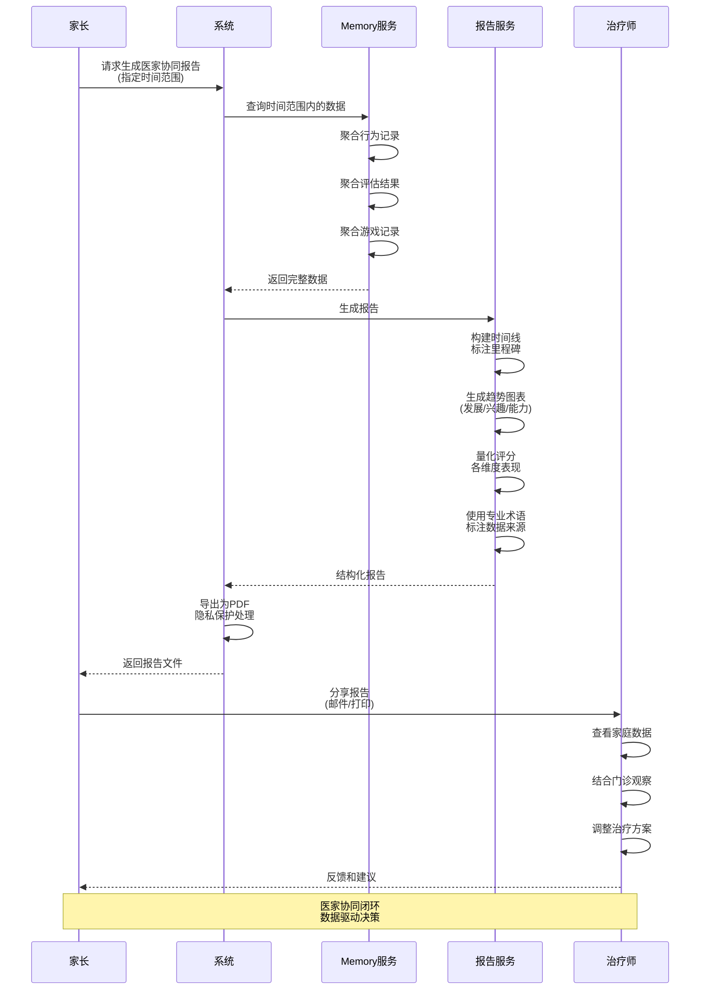

**报告特点**：
- **时间线展示**：按时间顺序展示行为记录，标注关键里程碑
- **多维度数据**：包含行为、评估、游戏等全方位数据
- **专业表达**：使用专业术语，便于治疗师理解
- **可视化图表**：趋势图、热力图、雷达图直观展示
- **隐私保护**：只包含必要信息，支持匿名化

---

## 四、技术架构

### 4.1 整体架构

系统采用分层架构设计，从下至上分为基础设施层、业务服务层和API层。基础设施层提供数据存储和AI能力支撑，业务服务层实现核心功能逻辑，API层处理请求路由和响应。Memory服务作为数据中枢，连接时序知识图谱与结构化存储，各业务服务通过Memory层进行数据交换，实现松耦合的协作。

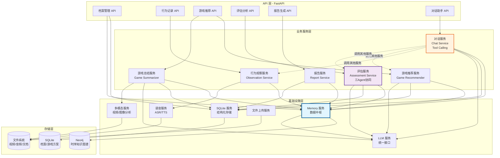

**架构说明**：

1. **API层**：基于FastAPI构建，提供RESTful接口，处理HTTP请求和响应，实现参数验证和错误处理

2. **业务服务层**：
   - **行为观察服务**：处理日常记录和游戏记录，调用Memory服务存储数据
   - **游戏推荐服务**：基于评估结果和兴趣点生成个性化游戏方案
   - **游戏总结服务**：分析游戏视频，生成总结报告，验证兴趣点
   - **评估服务**：三个Agent协同工作（兴趣挖掘、功能分析、综合评估）
   - **报告服务**：生成医家协同报告，提供数据可视化
   - **对话服务**：通过Tool Calling机制调用其他服务，提供自然语言交互

3. **基础设施层**：
   - **Memory服务**：数据中枢，封装Graphiti操作，提供语义化的读写接口，维护缓存
   - **SQLite服务**：管理结构化数据（档案、游戏方案、会话记录）
   - **LLM服务**：统一的LLM调用接口，支持多种模型切换
   - **多模态服务**：视频和图像分析能力
   - **语音服务**：语音识别和合成
   - **文件上传服务**：处理文件上传和存储

4. **存储层**：
   - **Neo4j**：存储时序知识图谱，记录行为、兴趣、功能维度的时序关系
   - **SQLite**：存储结构化数据
   - **文件系统**：存储多媒体文件

**服务调用特点**：
- 业务服务通过Memory服务访问知识图谱，实现数据共享
- 对话服务作为统一入口，可以调用其他业务服务
- 所有需要LLM能力的服务都通过LLM服务统一调用
- 服务间松耦合，支持独立测试和部署

### 4.2 技术栈

系统采用现代化的技术栈，充分利用开源生态和云服务能力，确保系统的可扩展性和稳定性。

| 类别 | 技术选型 | 版本要求 | 应用场景 |
|------|---------|---------|---------|
| **Web框架** | FastAPI | ≥0.115.0 | 异步API服务，自动生成OpenAPI文档 |
| **异步运行时** | Uvicorn | ≥0.30.0 | ASGI服务器，支持WebSocket |
| **时序知识图谱** | Graphiti-core | ≥0.17.0 | 时序感知的知识图谱，自动实体提取 |
| **图数据库** | Neo4j | ≥5.0.0 | 存储时序知识图谱，支持Cypher查询 |
| **结构化存储** | SQLite + SQLAlchemy | ≥2.0.0 | 档案、游戏方案等结构化数据 |
| **LLM服务** | 通义千问 (qwen-plus) | - | 主力模型，支持Function Calling |
| | 通义千问 (qwen-flash) | - | 轻量模型，快速响应场景 |
| | DeepSeek | - | 备选模型，支持切换 |
| **Embedding** | text-embedding-v3 | - | 1536维向量，语义检索 |
| **多模态理解** | 通义千问VL (qwen3-vl-plus) | - | 视频和图像分析 |
| **语音服务** | 阿里云NLS | - | 语音识别(ASR)和合成(TTS) |
| **文件处理** | PyPDF + Pillow + OpenCV | - | 文档解析、图像处理、视频分析 |
| **依赖注入** | 自研Container | - | 服务生命周期管理，支持Mock切换 |
| **Agent实现** | 自研Tool Registry + Function Calling | - | 服务即工具，LLM可调用 |

**技术选型亮点**：

1. **Graphiti时序知识图谱**：相比传统知识图谱，Graphiti原生支持时序信息，能够自动追踪实体和关系随时间的变化。这对于ASD干预场景至关重要，因为需要捕捉"第一次主动叫妈妈"、"眼神接触持续时间从2秒增加到5秒"等关键时刻。Graphiti的自动实体提取能力减少了人工标注工作，LLM直接从自然语言描述中提取结构化数据。

2. **自研Agent架构**：采用轻量级的Agent实现方案，通过自研的Tool Registry和LLM Function Calling机制实现Multi-Agent协同。相比LangChain等重量级框架，这种方案更灵活、可控，便于调试和优化。评估服务的三个Agent（兴趣挖掘、功能分析、综合评估）通过统一的LLM服务协调工作，数据通过Memory服务共享。

3. **通义千问双模型策略**：qwen-plus作为主力模型处理复杂任务（评估、推荐），qwen-flash处理简单任务（记录解析、快速查询），在保证质量的同时优化成本和响应速度。

4. **自研依赖注入容器**：支持Mock/Real服务切换，开发阶段可以使用Mock服务快速验证逻辑，生产环境切换到真实服务。延迟初始化机制确保Neo4j等外部依赖不可用时系统仍能启动。

### 4.3 数据流设计

系统的数据流设计围绕Memory服务展开，实现"写入时智能解析，读取时语义检索"的模式。

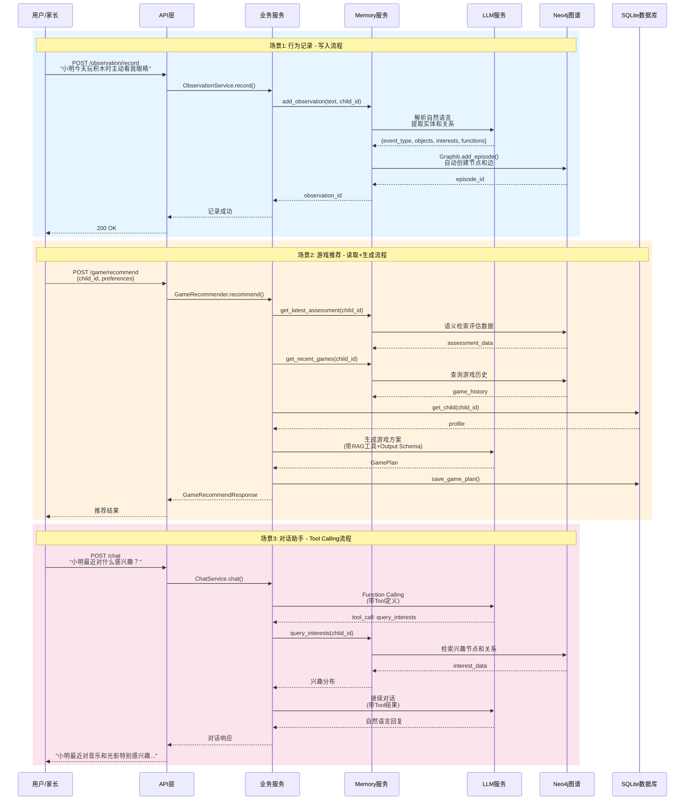

**数据流特点**：

1. **写入时智能解析**：
   - 用户输入自然语言描述（文字或语音）
   - LLM自动提取结构化信息（事件类型、涉及对象、兴趣维度、功能维度）
   - Graphiti自动创建实体节点和关系边，维护时序信息
   - 无需家长学习专业术语或填写复杂表单

2. **读取时语义检索**：
   - 业务服务通过Memory服务的语义化接口查询数据
   - Memory服务将业务查询转换为图查询（Cypher）
   - 支持时间范围过滤、相似度检索、关系路径查询
   - 返回结构化数据供业务服务使用

3. **Memory服务缓存机制**：
   - 同一会话内的重复查询使用缓存，减少Neo4j访问
   - 评估结果缓存，避免重复计算
   - 档案信息缓存，减少SQLite查询
   - 缓存失效策略：数据更新时自动清除相关缓存

4. **双存储协同**：
   - **Neo4j**：存储动态的、时序的、关系密集的数据（行为记录、兴趣变化、功能进展）
   - **SQLite**：存储静态的、结构化的数据（档案信息、游戏方案模板、会话元数据）
   - Memory服务负责协调两者，业务服务无需关心数据存储位置

5. **LLM调用优化**：
   - 结构化输出：使用JSON Schema约束LLM输出格式，减少解析错误
   - 批量处理：多个相似任务合并为一次LLM调用
   - 流式输出：对话场景使用流式响应，提升用户体验
   - 错误重试：LLM调用失败时自动重试，带指数退避

用户输入 → LLM解析提取实体 → Memory层写入Graphiti → 各服务从Memory层读取 → 协同处理 → 结果返回用户。Memory层维护缓存，减少重复查询，为服务间提供共享状态。

---

## 五、技术亮点与创新

### 5.1 记忆驱动的 Multi-Agent 架构

系统采用自研的轻量级Multi-Agent架构，以Memory服务作为数据中枢，实现Agent间的松耦合协同。这种设计相比LangGraph等重量级框架更灵活、可控，更适合ASD干预场景的复杂需求。

在技术选型时，我们评估了LangGraph这类成熟的Agent编排框架。LangGraph在通用场景下表现优秀，但在本项目中存在明显的局限性。首先是框架过重导致的灵活性不足。以对话助手场景为例，用户可能随时提出不同类型的需求："帮我记录一下孩子今天的表现"、"推荐个游戏"、"孩子最近进步如何"。这些需求是动态的、不可预测的。如果使用LangGraph，需要预先定义完整的状态图，包含所有可能的节点和边，每次新增Agent或修改调用逻辑都需要重新设计状态图。而我们的自研方案通过Tool Registry动态注册服务，LLM根据用户意图自主选择调用哪些工具，新增Agent只需注册为新工具，无需修改编排逻辑。

状态管理的复杂性是另一个关键问题。评估服务包含三个Agent：兴趣挖掘、功能分析、综合评估。它们需要共享大量上下文数据，包括孩子档案、历史行为记录、游戏总结等，而且这些数据可能在执行过程中被其他服务更新。使用LangGraph需要在State中维护所有共享数据，每个节点都要处理State的读写，当数据量大时State会变得臃肿。如果其他服务更新了数据，还需要手动同步State，容易出现数据不一致。我们的方案中，三个Agent都从Memory服务读取数据，Memory服务维护统一的缓存，数据更新时缓存自动失效，下次读取就能获取最新数据。Agent只需关注自己的业务逻辑，无需管理复杂的状态传递。此外，LangGraph的执行流程被框架封装，出现问题时难以定位是哪个节点、哪个状态转换出错，而自研方案中每个Agent都是独立的服务，可以单独测试、单独监控，问题定位更直接。

Memory服务作为数据中枢，为Multi-Agent协同提供了独特的优势。各Agent通过Memory服务共享数据，无需直接依赖。游戏推荐Agent不需要知道评估Agent的存在，只需要从Memory服务读取评估结果。这种松耦合设计使得Agent可以独立开发、独立测试、独立部署。传统方案中Agent之间是强依赖链（Agent A → Agent B → Agent C），而记忆驱动方案中所有Agent都通过Memory解耦（Agent A → Memory ← Agent B ← Memory ← Agent C）。

Memory服务维护统一的缓存层，确保同一会话内所有Agent看到的数据是一致的。当数据更新时，缓存自动失效，避免了脏读问题。实际案例中，游戏总结Agent分析完视频后会将新的行为记录写入Memory，评估Agent在生成报告时能够立即读取到这些最新数据，无需手动同步。基于Graphiti时序知识图谱，Memory服务天然支持时间维度的查询，Agent可以轻松获取"最近一周的行为记录"、"上个月的评估结果"、"第一次出现某行为的时间"等时序信息，这对于追踪孩子发展至关重要。

Memory服务还根据访问模式智能缓存热点数据。例如，对话助手频繁查询孩子档案和最近的评估结果，这些数据会被缓存在内存中，大幅提升响应速度。系统的可扩展性也得到了保证，新增Agent时只需实现业务逻辑、通过Memory服务读写数据、注册为Tool供对话助手调用，无需修改其他Agent的代码，无需重新设计整体架构。

对比两种方案，LangGraph需要预定义状态图、修改成本高，而记忆驱动方案支持动态调用、新增Agent无需改架构。LangGraph的State在节点间传递容易臃肿，记忆驱动方案由Memory统一管理、自动缓存失效。LangGraph需要手动同步State来保证数据一致性，记忆驱动方案由Memory自动保证。LangGraph框架封装导致问题定位困难，记忆驱动方案的服务独立使问题定位更直接。LangGraph需要自己实现时序支持，而Graphiti原生支持时序查询。LangGraph需要学习框架概念和API，记忆驱动方案使用标准的服务调用模式，学习成本更低。

这种记忆驱动的架构设计，既保证了Agent间的灵活协同，又避免了重量级框架带来的复杂性，特别适合需要频繁迭代、动态扩展的ASD干预场景。

**架构对比图**：

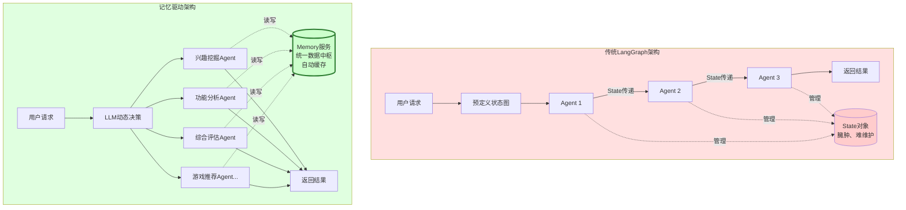

**对比说明**：
- **传统架构**：预定义状态图，Agent间强依赖，State对象臃肿，扩展困难
- **记忆驱动架构**：LLM动态决策，Agent松耦合，Memory统一管理，灵活扩展

### 5.2 时序知识图谱搭建

ASD干预场景对"时序"有着强烈的依赖。家长和治疗师需要追踪孩子行为随时间的变化，识别发展趋势，捕捉"第一次主动叫妈妈"、"眼神接触从2秒增加到5秒"这样的关键时刻。传统知识图谱虽然能够存储实体和关系，但缺乏对时间维度的原生支持，查询"最近一周的行为记录"、"上个月的评估结果"需要复杂的时间戳过滤和排序。更重要的是，传统图谱难以表达"某个行为是第一次出现"、"某个兴趣点在逐渐增强"这样的时序语义。

Graphiti作为时序感知的知识图谱框架，完美匹配了这一需求。它将时间作为图谱的一等公民，每个节点和边都自动携带时间戳，支持基于时间范围的查询和聚合。系统可以轻松回答"孩子在过去两周内对音乐的兴趣强度变化"、"社交互动行为的出现频率趋势"等问题。Graphiti的Episode机制将每次观察记录作为一个时间切片，自动维护实体在不同时间点的状态，使得追踪发展轨迹变得自然而直接。

Graphiti的另一个核心优势是自动实体关系提取。传统方案中，家长的自然语言描述需要经过复杂的NLP流程才能转化为结构化数据：分词、命名实体识别、关系抽取、消歧、对齐等步骤，每一步都可能引入错误。而Graphiti直接利用LLM的理解能力，通过精心设计的提取指令（Extraction Instructions）和实体模型（Entity Models），一次性完成从文本到图谱的转换。

系统定义了六类核心实体模型：Behavior（行为）、Object（对象）、Interest（兴趣）、Function（功能）、Person（人物）、Assessment（评估）。每个模型都是Pydantic类，明确定义了字段类型、取值范围和语义约束。例如，Behavior模型包含event_type（事件类型：social/emotion/communication/firstTime/other）、significance（重要性：breakthrough/improvement/normal/concern）、emotional_state（情绪状态）等字段。这些模型既是LLM提取的schema，也是图谱存储的结构，确保了数据的一致性和可验证性。

提取指令采用分层设计。对于日常行为记录，系统只提取基础实体（Behavior、Object、Person），不提取高级关联（Interest、Function）。这是因为兴趣和功能的判断需要结合历史数据和专业知识，不应该在单次记录时做出。评估服务会在分析历史数据时建立这些高级关联，例如"孩子玩积木"这个行为，评估Agent会根据历史模式判断它体现了construction兴趣和fine_motor_skills功能。这种分层设计避免了过度推断，保证了数据的客观性。

对于游戏总结和评估报告，系统使用专门的提取指令。游戏总结提取指令要求综合游戏设计、视频分析、家长反馈，生成结构化的总结信息，包括参与度评分、目标达成度、亮点时刻、需要关注的问题、改进建议等。评估提取指令则指导LLM从历史行为数据中识别兴趣偏好、功能趋势、发展水平，生成个性化的干预建议。这些提取指令本质上是给LLM的详细任务说明，确保提取结果符合业务需求。

Graphiti的增量更新能力也至关重要。每次新增观察记录时，Graphiti不是简单地添加新节点，而是智能地判断是否需要更新已有实体。例如，家长今天记录"小明玩积木"，昨天也记录过"小明玩积木"，Graphiti会识别出这是同一个孩子和同一个对象，只创建新的行为节点和关系，而不是重复创建孩子和积木节点。这种实体消歧和合并机制，使得图谱能够随着数据积累逐渐完善，而不是变得冗余和混乱。

时序查询能力让系统能够回答复杂的时间相关问题。Memory服务提供了丰富的时序查询接口：get_behaviors_in_range（获取时间范围内的行为）、get_interest_trend（获取兴趣强度随时间的变化）、get_first_occurrence（获取某行为首次出现的时间）、get_recent_milestones（获取最近的里程碑事件）。这些查询直接利用Graphiti的时序索引，性能优异。评估Agent可以轻松分析"过去一个月孩子在社交互动方面的进步"，游戏推荐Agent可以查询"最近两周验证成功的兴趣点"，报告服务可以生成"三个月发展趋势图"。

Graphiti与Neo4j的结合提供了强大的图查询能力。虽然Graphiti封装了大部分操作，但系统仍然保留了直接访问Neo4j的能力，用于复杂的图分析任务。例如，查询"与某个兴趣点相关的所有行为和对象"，可以使用Cypher语句进行多跳路径查询。这种灵活性确保了系统既能享受Graphiti的便利性，又不失去图数据库的表达能力。

通过Graphiti时序知识图谱，系统实现了从"记录行为"到"理解发展"的跨越。每一次家长的观察记录都不是孤立的数据点，而是孩子发展轨迹上的一个坐标。随着数据的积累，图谱逐渐勾勒出孩子的成长画像：哪些兴趣在增强，哪些功能在进步，哪些时刻是突破，哪些模式在重复。这种时序感知的数据组织方式，为后续的评估、推荐、报告提供了坚实的基础。

**时序知识图谱实体关系图**：

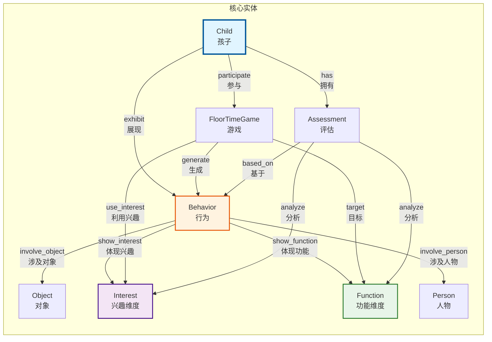

**图谱特点**：
- 所有节点和边都携带时间戳，支持时序查询
- Behavior节点记录具体的行为表现，是数据的基本单元
- Interest和Function节点由评估层建立，不在记录时创建
- Game节点连接推荐和实施，形成闭环反馈

### 5.3 基于GraphRAG的专业知识建模

ASD干预是一个高度专业化的领域，需要大量的理论知识、实践经验和干预方法作为支撑。系统面临的核心挑战是：如何让LLM在推荐游戏、生成评估、提供建议时，不是凭空想象，而是基于真实的专业数据？答案是构建一个强大的专业知识检索系统。

系统基于微软开源的GraphRAG框架，对80GB+的专业文献进行了深度处理和索引，构建了三层分级的知识体系：方法论层（地板时光理论、DIR模型、干预原则）、实操层（3000+游戏案例、干预技巧、应对策略）、量表层（评估标准、发展里程碑、诊断工具）。这些知识不是简单地存储为文本，而是通过GraphRAG的知识图谱技术，建立了实体、关系、社区的多层次结构，使得LLM能够精准地检索到相关的专业知识。

**GraphRAG的核心优势：社区检测与分层检索**

传统的RAG（检索增强生成）依赖向量相似度检索，面对"推荐一个适合3岁孤独症儿童的社交互动游戏"这样的查询，往往只能找到包含这些关键词的文档片段，无法理解游戏的适用场景、目标维度、难度等级之间的关联。GraphRAG通过知识图谱的社区检测算法，将知识组织为多层次的社区结构，每个社区代表一个主题或概念簇，并自动生成社区摘要报告。

社区检测算法（基于Leiden算法）将知识图谱划分为不同层级的社区。底层社区包含细粒度的实体和关系，如"积木游戏"、"眼神接触"、"轮流等待"；中层社区聚合相关的游戏类型和干预目标，如"建构类游戏"、"社交互动训练"；顶层社区代表宏观的主题，如"认知发展"、"情绪调节"。每个社区都有LLM生成的摘要报告，描述该社区的核心内容、关键实体、典型案例。这种分层结构使得系统既能进行精确的实体级检索，又能进行宏观的主题级检索。

系统支持两种互补的检索模式：本地搜索（Local Search）和全局搜索（Global Search）。本地搜索适用于需要精确信息的场景，如"积木游戏的具体步骤"、"如何应对孩子的注意力分散"。它首先通过向量相似度找到相关的实体（如"积木游戏"实体），然后沿着知识图谱的边扩展，检索与该实体相关的其他实体、关系、文本片段、社区报告，最终组合成一个包含多源信息的上下文。这种方式确保了检索结果的相关性和完整性。

全局搜索则适用于需要宏观理解的场景，如"地板时光的核心原则是什么"、"如何设计一个完整的干预方案"。它采用Map-Reduce策略，在Map阶段，将所有社区报告分批发送给LLM，每批生成一个中间回答并评分；在Reduce阶段，筛选出高分的中间回答，聚合后生成最终答案。这种方式能够综合整个知识库的信息，给出全面的、多角度的回答。

**数据分层分级的实现**

系统对80GB+的专业文献进行了精细的分层处理。方法论层包含地板时光理论文献、DIR模型文档、干预原则指南，这些文档被解析为核心概念实体（如"共同注意力"、"情感联结"、"功能性情绪发展阶梯"），并建立概念之间的关系（如"共同注意力"是"社交互动"的基础）。实操层包含3000+游戏案例文档，每个游戏被提取为结构化的实体，包含游戏名称、目标维度、适用年龄、难度等级、所需材料、详细步骤、注意事项等属性，并与相关的兴趣点、功能维度建立关联。量表层包含各类评估量表、发展里程碑表、诊断标准，这些数据被组织为评估维度实体和评分标准关系。

GraphRAG的索引构建过程自动完成了实体提取、关系识别、社区检测、摘要生成。系统使用通义千问作为LLM引擎，从文档中提取实体和关系；使用Leiden算法进行社区检测，将图谱划分为多层次的社区；为每个社区生成摘要报告，描述该社区的核心内容。最终生成的知识图谱包含数万个实体节点、数十万条关系边、数千个社区，形成了一个结构化的、可检索的专业知识库。

**RAG服务的封装与调用**

系统将GraphRAG封装为一个独立的服务，通过RESTful API对外提供检索能力。LLM服务层定义了search_games工具，游戏推荐Agent可以通过Function Calling机制调用这个工具。当Agent需要参考成功案例时，它会构造查询（如"适合3岁孤独症儿童的社交互动游戏，利用音乐兴趣"），调用search_games工具，GraphRAG服务执行本地搜索，返回相关的游戏案例、干预技巧、注意事项。Agent基于这些检索结果，结合孩子的具体情况，生成个性化的游戏方案。

这种设计确保了系统推荐的游戏、说的话都有专业数据支撑。不是LLM凭空编造一个游戏，而是参考了真实的、经过验证的干预案例。不是随意给出建议，而是基于专业文献中的干预原则和实践经验。评估Agent在生成报告时，也会调用RAG服务检索相关的评估标准和发展里程碑，确保评估的专业性和准确性。

**GraphRAG数据流程图**：

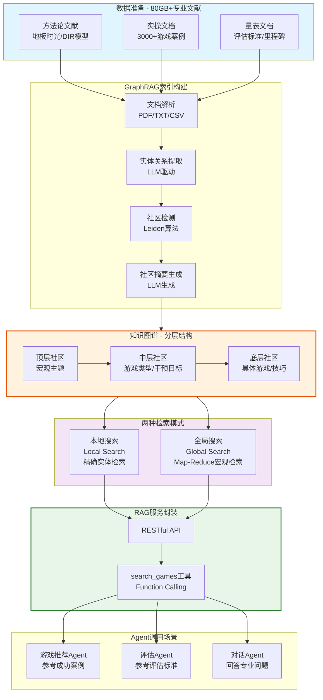

**技术特点总结**：

1. **社区检测算法**：Leiden算法将知识图谱划分为多层次社区，每个社区代表一个主题簇，自动生成摘要报告
2. **本地搜索**：基于实体的精确检索，沿图谱边扩展，获取相关实体、关系、文本片段
3. **全局搜索**：Map-Reduce策略，综合所有社区报告，给出宏观的、全面的答案
4. **数据分层**：方法论、实操、量表三层结构，80GB+专业文献，3000+游戏案例
5. **服务封装**：RESTful API + Function Calling工具，LLM可直接调用
6. **专业支撑**：推荐的游戏、生成的评估、给出的建议都有真实专业数据支撑

通过GraphRAG的专业知识建模，系统实现了从"通用AI"到"专业助手"的转变。LLM不再是凭空想象，而是站在80GB+专业文献的肩膀上，为每个ASD儿童家庭提供有据可依、有理可循的干预建议。

---

## 六、工具整合与鲁棒性

### 6.1 阿里云生态整合

系统深度整合了阿里云的AI服务生态，充分利用通义千问系列模型和配套服务的能力。通义千问qwen-plus作为主力LLM，处理复杂的推理任务，如评估分析、游戏设计、对话理解。其强大的中文理解能力和Function Calling支持，使得系统能够准确理解家长的口语化描述，正确调用各项服务。通义千问qwen-flash作为轻量模型，处理简单快速的任务，如行为记录解析、快速查询响应，在保证质量的同时优化成本和响应速度。

通义千问的JSON Schema结构化输出能力是系统的关键依赖。传统的LLM输出是自由文本，需要复杂的后处理才能提取结构化数据，容易出错。通义千问支持在请求中指定JSON Schema，LLM的输出会严格遵循schema的结构和类型约束。系统利用这一能力，将所有需要结构化数据的场景（行为提取、游戏生成、评估报告）都定义为Pydantic模型，转换为JSON Schema传给LLM，确保输出可以直接反序列化为Python对象，无需额外的解析和验证。这种"schema-first"的设计大幅提升了系统的可靠性。

text-embedding-v3作为向量化模型，为语义检索提供支持。Memory服务中的兴趣点匹配、相似行为查找、历史游戏检索，都依赖于向量相似度计算。1536维的向量空间提供了足够的表达能力，能够捕捉语义的细微差异。通义千问VL（qwen3-vl-plus）作为多模态模型，处理视频和图像分析任务。游戏总结服务上传游戏视频后，通义千问VL能够识别孩子的关键行为、情绪状态、互动质量，生成详细的分析报告。

阿里云NLS（Natural Language Service）提供语音识别和合成能力。家长可以通过语音输入行为记录，NLS将语音转换为文字后，再由LLM进行语义理解和实体提取。这种语音输入方式特别适合忙碌的家长，在陪伴孩子的同时就能完成记录，无需停下来打字。语音合成则用于生成游戏引导的语音提示，提供更友好的交互体验。

系统采用统一的LLM服务层封装所有模型调用，提供一致的接口和错误处理。无论是通义千问、DeepSeek还是其他兼容OpenAI API的模型，都可以通过配置切换，无需修改业务代码。这种设计既保证了对阿里云生态的深度利用，又保持了技术栈的灵活性，避免了供应商锁定。

### 6.2 服务即工具（Tool Calling 设计）

系统采用"服务即工具"的设计理念，将每个核心服务的能力封装为LLM可调用的工具。这种设计使得对话助手能够通过Function Calling机制灵活编排各项服务，用户只需用自然语言表达需求，系统自动判断需要调用哪些服务、以什么顺序调用、如何组合结果。

传统的对话系统通常采用意图识别+槽位填充的方式。系统预先定义一组意图（如"记录行为"、"推荐游戏"），用户输入后先识别意图，再提取槽位值，最后调用对应的服务。这种方式的问题在于意图集合是固定的，新增功能需要重新训练意图识别模型，而且难以处理复杂的多意图组合场景。例如，用户说"小明今天玩积木很开心，帮我推荐个类似的游戏"，这句话同时包含"记录行为"和"推荐游戏"两个意图，传统方式很难正确处理。

Function Calling机制提供了更优雅的解决方案。系统将每个服务定义为一个工具（Tool），包含工具名称、描述、参数schema。LLM在理解用户输入后，自主决定需要调用哪些工具、传入什么参数。对于上面的例子，LLM会识别出需要先调用record_behavior工具记录"玩积木很开心"，然后调用recommend_game工具推荐游戏。整个过程无需预定义意图，LLM根据工具描述和参数schema自主规划。

系统实现了自研的Tool Registry，负责工具的注册、管理和执行。每个Tool对象包含四个核心要素：name（工具名称）、description（工具描述，告诉LLM这个工具是做什么的）、parameters（参数定义，使用JSON Schema格式）、function（实际执行的函数，支持同步和异步）。Tool Registry提供统一的注册接口，服务启动时将自己的能力注册为工具。例如，Memory服务注册了record_behavior、query_behaviors、query_interests等工具，Game服务注册了recommend_game工具，Assessment服务注册了generate_assessment工具。

工具描述的设计至关重要。一个好的工具描述需要清晰地告诉LLM：这个工具在什么场景下使用、能解决什么问题、有什么限制。例如，record_behavior工具的描述是"【必须调用】记录孩子的行为观察。当用户消息中包含孩子的行为、兴趣、表现描述时，必须立即调用此工具。触发词包括但不限于：喜欢、讨厌、做了、表现、感兴趣、玩了、说了、看了、听了。无需询问用户确认，直接记录。"这个描述明确了触发条件（包含行为描述）、触发词列表、执行策略（无需确认），确保LLM能够正确判断何时调用。

参数schema使用JSON Schema格式定义，既是LLM生成参数的约束，也是系统验证参数的依据。例如，recommend_game工具的参数schema定义了child_id（必填，字符串类型）和context（可选，字符串类型）。LLM在调用工具时必须提供符合schema的参数，系统收到参数后使用Pydantic模型进行验证，确保类型正确、必填字段存在、取值范围合法。这种双重约束机制大幅降低了参数错误的概率。

工具执行采用异步模式。当LLM决定调用某个工具时，系统从Tool Registry中查找对应的Tool对象，提取其function字段，传入参数执行。Tool类的execute方法自动判断function是同步还是异步，统一以异步方式返回结果。这种设计使得工具开发者无需关心异步细节，只需实现业务逻辑即可。执行结果会被序列化为JSON格式，作为tool message添加到对话历史中，LLM根据这些结果生成最终回复。

系统定义了九个核心工具，覆盖了所有主要功能：record_behavior（记录行为观察）、query_behaviors（查询历史行为）、query_interests（查询兴趣分布）、query_dimension_progress（查询维度进展）、get_latest_assessment（获取历史评估）、get_recent_games（获取游戏记录）、recommend_game（推荐干预游戏）、generate_assessment（生成发展评估）、get_child_profile（获取孩子档案）。这些工具分别对应Memory服务、Game服务、Assessment服务、SQLite服务的核心能力。

对话助手的工作流程是一个多轮交互过程。用户发送消息后，系统构建包含系统提示词、对话历史、用户消息的messages列表，连同工具定义一起发送给LLM。LLM返回的响应可能包含文本内容，也可能包含tool_calls（工具调用请求）。如果包含tool_calls，系统依次执行这些工具，将执行结果添加到messages中，再次调用LLM生成基于工具结果的回复。这个过程可能重复多次，直到LLM不再请求工具调用，返回最终的文本回复。

这种设计的优势在于灵活性和可扩展性。新增功能时，只需实现服务逻辑、定义工具描述和参数schema、注册到Tool Registry，对话助手立即就能调用新功能，无需修改对话逻辑。工具之间可以自由组合，LLM根据用户需求自主编排调用顺序。例如，用户问"小明最近进步如何，推荐个游戏巩固一下"，LLM会先调用query_dimension_progress查询进展，再调用recommend_game推荐游戏，最后综合两个结果生成回复。

系统还实现了工具调用的可观测性。每次工具调用都会打印详细的日志，包括工具名称、参数、执行结果、耗时等信息。这些日志不仅用于调试，也为后续的工具使用分析提供数据。例如，可以统计哪些工具被频繁调用、哪些参数组合容易出错、哪些工具链条效果最好，从而持续优化工具设计和系统提示词。

通过"服务即工具"的设计，系统实现了从"功能调用"到"能力编排"的跨越。用户不再需要学习复杂的操作流程，只需用自然语言表达需求，系统自动将需求分解为工具调用序列，执行并整合结果。这种交互方式大幅降低了使用门槛，让家长能够专注于观察和陪伴孩子，而不是纠结于如何操作系统。

**Tool Calling工作流程图**：

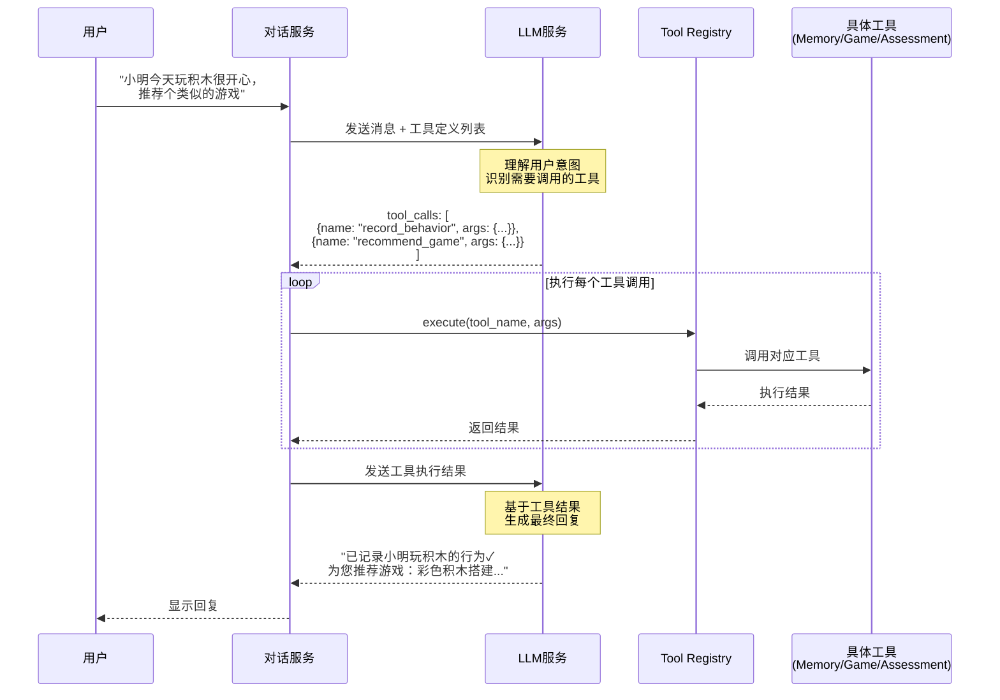

**流程说明**：
1. 用户用自然语言表达需求
2. LLM根据工具描述自主决定调用哪些工具
3. 系统依次执行工具，收集结果
4. LLM基于工具结果生成友好的回复
5. 整个过程对用户透明，无需了解技术细节

### 6.3 系统鲁棒性

系统的鲁棒性设计贯穿数据流的各个环节，从输入验证到输出控制，从错误处理到降级策略，确保在各种异常情况下都能提供稳定可靠的服务。

LLM的幻觉问题是AI系统面临的普遍挑战。LLM可能生成看似合理但实际错误的内容，特别是在缺乏明确约束的情况下。系统采用多层防护机制控制幻觉。第一层是结构化输出约束。所有需要结构化数据的场景都使用JSON Schema定义输出格式，LLM必须严格遵循schema的结构、类型、取值范围。例如，行为提取时event_type字段只能是"social"、"emotion"、"communication"、"firstTime"、"other"之一，LLM无法生成其他值。第二层是数据来源分离。关键数据（如孩子档案、历史行为记录、评估结果）从图谱和数据库检索，而不是让LLM生成。LLM只负责理解、分析、总结，不负责创造事实。第三层是置信度标注。评估报告中会明确标注数据量和置信度，例如"基于15条行为记录，置信度：中等"，让用户了解结论的可靠程度。

异常处理机制确保单点失败不影响整体。服务间调用采用try-catch包裹，捕获异常后记录日志、返回错误信息，而不是让异常向上传播导致整个请求失败。例如，游戏推荐服务调用Memory服务获取评估结果时，如果Memory服务暂时不可用，游戏推荐服务会使用默认的评估数据或降级策略，仍然能够返回推荐结果，只是质量可能略有下降。LLM调用失败时，系统会自动重试，采用指数退避策略（第一次等待1秒，第二次等待2秒，第三次等待4秒），避免瞬时故障导致的失败。重试次数达到上限后，返回友好的错误提示，而不是技术性的堆栈信息。

依赖注入容器支持Mock/Real服务切换，提供了强大的降级能力。开发和测试阶段，可以使用Mock服务快速验证逻辑，无需启动Neo4j、配置LLM API Key等外部依赖。生产环境中，如果Neo4j暂时不可用，系统可以自动切换到Mock Memory Service，虽然无法提供真实的历史数据，但至少能够接受新的记录请求，避免数据丢失。延迟初始化机制确保服务启动时不会因为某个外部依赖不可用而完全失败，只有在实际使用该服务时才会尝试连接。

Memory服务的缓存机制不仅提升性能，也增强了鲁棒性。同一会话内的重复查询直接从缓存返回，避免了重复的图谱查询和LLM调用。即使图谱查询偶尔失败，缓存中的数据仍然可用。缓存采用LRU（Least Recently Used）策略，自动淘汰不常用的数据，避免内存溢出。缓存失效策略确保数据更新后，相关缓存立即清除，避免脏读。

长链任务的稳定性通过中间结果缓存保证。例如，生成评估报告是一个多步骤的过程：查询历史行为→兴趣挖掘→功能分析→综合评估。如果在综合评估步骤失败，前面三个步骤的结果已经缓存，重试时无需重新执行，直接从综合评估步骤开始。这种断点恢复机制大幅提升了长链任务的成功率，也节省了LLM调用成本。

参数验证采用Pydantic模型，在数据进入业务逻辑之前就进行严格检查。类型错误、缺失必填字段、超出取值范围等问题会在验证阶段被捕获，返回清晰的错误提示，而不是在业务逻辑中引发难以追踪的异常。例如，游戏推荐请求中的child_id必须是非空字符串，如果传入空值或null，Pydantic会立即抛出ValidationError，系统返回"child_id不能为空"的友好提示。

数据一致性通过事务和锁机制保证。虽然Neo4j和SQLite都支持事务，但跨数据库的一致性仍然是挑战。系统采用最终一致性模型，允许短暂的不一致，但通过补偿机制确保最终达到一致状态。例如，游戏总结写入Memory服务后，会异步更新SQLite中的游戏状态。如果更新失败，系统会记录待补偿任务，定期重试，直到成功。

监控和告警机制提供实时的系统健康状态。关键指标（LLM调用成功率、响应时间、错误率、缓存命中率）被持续收集和分析。当指标异常时（如LLM调用成功率低于95%），系统会触发告警，通知运维人员及时处理。详细的日志记录每次请求的完整流程，包括输入参数、中间结果、最终输出、耗时分布，为问题排查提供充分的信息。

通过这些多层次的鲁棒性设计，系统能够在真实的、复杂的、不确定的环境中稳定运行。即使面对网络波动、服务故障、数据异常、用户误操作等各种情况，系统仍然能够提供基本的服务，保护用户数据，给出友好的反馈。这种鲁棒性不是一蹴而就的，而是在持续的测试、优化、实践中逐步建立起来的。

**系统鲁棒性设计图**：

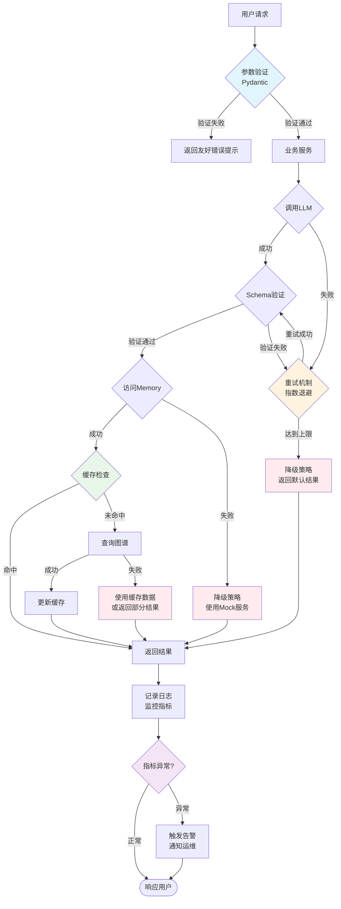

**鲁棒性特点**：
- **多层验证**：参数验证、Schema验证、业务逻辑验证
- **自动重试**：LLM调用失败时指数退避重试
- **降级策略**：服务不可用时使用Mock或缓存数据
- **缓存机制**：减少重复查询，提升性能和可用性
- **监控告警**：实时监控关键指标，异常时及时告警

---

## 七、用户体验与产品亮点

系统的设计始终围绕一个核心理念：让技术服务于人，而不是让人适应技术。ASD儿童的家长已经承受着巨大的压力和挑战，系统不应该成为额外的负担，而应该是真正的助手和伙伴。

自然语言交互是降低使用门槛的关键。家长无需学习专业术语、填写复杂表单、记忆操作步骤，只需像和朋友聊天一样，用最自然的方式描述观察到的情况。"小明今天玩积木时主动看我眼睛了"、"他最近对音乐特别感兴趣"、"帮我推荐个游戏"，这些日常的表达就是系统的输入。对话助手理解意图后，自动调用相应的服务，完成记录、查询、推荐等操作。家长不需要知道背后有Memory服务、Game服务、Assessment服务，只需要知道系统"听懂了"、"记住了"、"给出了建议"。

语音输入进一步降低了记录的摩擦。家长在陪伴孩子玩耍时，往往无法停下来打字。通过语音输入，家长可以边玩边说，"小明刚才主动递给我积木"，系统自动将语音转为文字，提取关键信息，存入图谱。这种"无感记录"的方式，让记录成为陪伴的一部分，而不是陪伴的中断。

渐进式信息披露避免了信息过载。初次使用时，系统只展示最核心的功能：记录行为、查看进展、获取建议。随着使用的深入，系统逐步引导家长了解更多功能：数据可视化、详细评估、游戏定制。这种"用到再学"的方式，让家长不会在一开始就被复杂的功能吓退，而是在实际需求中自然地掌握系统的能力。

即时反馈增强了使用的信心。每次记录行为后，系统立即确认"已记录✓"，并简要总结关键信息。查询进展时，系统不是简单地返回数据，而是用温暖的语言总结："小明在社交互动方面进步明显，最近一周主动发起互动的次数增加了3倍。"推荐游戏时，系统解释推荐理由："这个游戏利用了小明对音乐的兴趣，同时能够锻炼眼神接触和轮流等待的能力。"这些即时、友好、有温度的反馈，让家长感受到系统是在"理解"而不是"执行"。

数据可视化让抽象的进步变得具体可见。兴趣热力图用颜色深浅直观展示孩子在8个兴趣维度的强度分布，家长一眼就能看出孩子最喜欢什么。发展趋势图以时间线的方式展示各功能维度的进步曲线，特别标注关键的里程碑时刻，如"2024-01-15：首次主动叫妈妈"。能力雷达图全面展示孩子在33个功能维度的表现，清晰呈现优势和需要关注的方面。这些可视化不是为了炫技，而是为了让家长能够"看见"孩子的成长，获得坚持下去的动力。

游戏推荐的个性化和可操作性是系统的核心价值。每个推荐的游戏都是基于孩子的真实兴趣和当前发展水平定制的，不是从模板库中随机抽取。游戏步骤详细到每一个动作、每一句话，家长不需要猜测"应该怎么做"。材料清单列出所需的物品，大多是家中常见的东西，不需要特殊采购。安全注意事项提醒可能的风险，避免意外。成功标准明确可衡量，家长知道"做到什么程度算成功"。这种"拿来就用"的设计，让游戏推荐不是纸上谈兵，而是真正能够落地执行的方案。

游戏执行过程中的实时引导提供了"虚拟治疗师"般的支持。系统按步骤显示当前应该做什么，提示关键要点和预计时长。在关键时刻弹出提醒，如"注意观察孩子的眼神"。当孩子出现特定行为时，提供应对建议，例如孩子注意力分散时如何重新吸引，孩子情绪激动时如何安抚。这些实时的、情境化的指导，弥补了家长缺乏专业训练的不足，让他们在执行游戏时更有信心和方向感。

AI视频分析解放了家长的双手和注意力。传统的记录方式要求家长在陪伴孩子的同时还要记笔记、填表格，很难做到全情投入。有了视频分析，家长只需要录制游戏过程，系统自动识别关键行为、评估互动质量、生成总结报告。家长可以专注于和孩子的互动，事后再查看分析结果。这种"先陪伴，后分析"的方式，让干预回归本质：高质量的亲子互动。

医家协同报告弥合了家庭和医疗机构之间的信息鸿沟。家长不再需要在门诊时努力回忆"孩子最近的表现"，而是直接分享系统生成的报告。报告包含详细的行为记录、量化的进展数据、可视化的趋势图表，使用专业术语描述，便于治疗师理解。治疗师能够看到孩子在家庭中的真实表现，而不仅仅是门诊时段的短暂观察，从而做出更准确的评估和更有针对性的治疗方案调整。这种数据驱动的医家协同，提升了整体干预效果。

系统的温度体现在每一个细节中。错误提示不是冰冷的技术术语，而是友好的建议："看起来网络有点慢，请稍后再试。"评估报告采用"三明治"结构，先肯定进步，再指出需要关注的地方，最后给出鼓励和建议，避免让家长感到挫败。对话助手使用温暖、支持性的语气，"小明进步很大，您做得很好！"这些看似微小的设计，传递的是对家长辛勤付出的认可和对孩子成长的信心。

隐私保护是系统设计的底线。所有敏感数据（孩子姓名、诊断信息、行为记录、视频文件）都在本地或私有云存储，不会上传到公共服务器。视频分析在本地完成，只提取结构化的分析结果。报告导出时可以选择匿名化，隐去孩子的真实姓名。系统不会将用户数据用于任何商业目的或与第三方共享。这种对隐私的尊重，是建立信任的基础。

通过这些用户体验设计，系统不仅是一个技术产品，更是一个有温度的陪伴者。它理解家长的困难，尊重家长的付出，支持家长的努力，见证孩子的成长。技术的价值不在于炫耀复杂性，而在于解决真实的问题，带来真实的帮助。

---

## 八、快速开始

### 8.1 环境要求

- Python 3.10+
- Neo4j 5.0+
- LLM API Key（通义千问或DeepSeek）

### 8.2 安装与配置

```bash
# 克隆项目
git clone <repo-url>
cd ASD_Agent

# 安装依赖
pip install -r requirements.txt

# 配置环境变量
cp .env.example .env
# 编辑 .env 填入 LLM_API_KEY 和 Neo4j 连接信息

# 初始化数据库
python scripts/init_graphiti_neo4j.py

# 启动服务
python src/main.py
```

### 8.3 运行演示

服务启动后访问 `http://localhost:8000/docs` 查看API文档，或访问前端界面进行交互。

---

## 九、项目结构

```
ASD_Agent/
├── src/                    # 应用层（API路由、数据模型）
├── services/               # 核心服务层
│   ├── Memory/            # 记忆服务（Graphiti集成、缓存、数据转换）
│   ├── Assessment/        # 评估服务（三Agent协同）
│   ├── game/              # 游戏服务（推荐、总结）
│   ├── Chat/              # 对话服务（Tool Calling Agent）
│   ├── LLM_Service/       # LLM统一接口
│   └── SQLite/            # 结构化存储
├── tests/                  # 测试
├── docs/                   # 文档
└── external/               # 外部依赖（Graphiti-core）
```

---

## 十、团队与致谢

### 10.1 团队成员

（待补充）

### 10.2 致谢

感谢残联提供的项目合作机会和真实需求场景，感谢地板时光理论的创始人Stanley Greenspan博士为ASD干预领域做出的贡献。

---

## 附录

### 附录A：33功能维度说明

系统基于DIR/Floortime模型的功能性情绪发展阶梯（FEDC），构建了33个功能维度，分为六大类：

**一、感觉调节与注意力（5个维度）**
- sensory_regulation：感觉调节能力
- attention_span：注意力持续时间
- sensory_seeking：感觉寻求行为
- sensory_avoiding：感觉回避行为
- multi_sensory_integration：多感觉整合能力

**二、社交互动（8个维度）**
- eye_contact：眼神接触
- social_smile：社交性微笑
- joint_attention：共同注意力
- social_initiation：社交主动性
- social_reciprocity：社交互惠性
- turn_taking：轮流等待
- sharing：分享行为
- empathy：共情能力

**三、沟通表达（7个维度）**
- verbal_communication：语言沟通
- nonverbal_communication：非语言沟通
- gesture_use：手势使用
- pointing：指向行为
- emotional_expression：情绪表达
- requesting：请求表达
- commenting：评论表达

**四、认知能力（6个维度）**
- problem_solving：问题解决
- symbolic_play：象征性游戏
- cause_effect_understanding：因果理解
- imitation：模仿能力
- memory：记忆能力
- categorization：分类能力

**五、运动技能（4个维度）**
- fine_motor_skills：精细运动
- gross_motor_skills：粗大运动
- motor_planning：运动计划
- coordination：协调能力

**六、自我调节（3个维度）**
- emotional_regulation：情绪调节
- frustration_tolerance：挫折容忍度
- self_soothing：自我安抚

每个维度都有明确的评分标准（0-10分）和发展阶段描述，支持量化评估和趋势分析。

### 附录B：8类兴趣维度说明

系统定义了8类兴趣维度，涵盖ASD儿童常见的兴趣类型：

**1. 视觉兴趣（Visual）**
- 典型表现：喜欢观察光影、旋转物体、彩色图案、动画
- 代表物品：积木、旋转齿轮、手电筒、镜子、绘本
- 干预价值：可用于吸引注意力、建立共同关注

**2. 听觉兴趣（Auditory）**
- 典型表现：喜欢听音乐、儿歌、特定声音、节奏
- 代表物品：乐器、音乐盒、有声书、铃铛
- 干预价值：可用于语言启蒙、节奏训练、情绪调节

**3. 触觉兴趣（Tactile）**
- 典型表现：喜欢触摸不同质地的物品、玩水、玩沙
- 代表物品：黏土、沙子、水、软胶玩具、毛绒玩具
- 干预价值：可用于感觉统合训练、精细运动发展

**4. 运动兴趣（Motor）**
- 典型表现：喜欢跳跃、旋转、摇摆、爬高
- 代表物品：滑梯、秋千、蹦床、球类
- 干预价值：可用于粗大运动发展、感觉调节

**5. 建构兴趣（Construction）**
- 典型表现：喜欢搭建、拼装、组合
- 代表物品：乐高、积木、磁力片、拼图
- 干预价值：可用于认知发展、问题解决、精细运动

**6. 秩序兴趣（Order）**
- 典型表现：喜欢排列、分类、整理、按规律摆放
- 代表物品：排序玩具、分类盒、叠叠乐
- 干预价值：可用于认知训练、规则理解、自我控制

**7. 认知兴趣（Cognitive）**
- 典型表现：喜欢数字、字母、地图、标志、动物
- 代表物品：数字卡片、字母书、地图、动物模型
- 干预价值：可用于认知发展、语言学习、知识扩展

**8. 社交兴趣（Social）**
- 典型表现：喜欢互动游戏、角色扮演、回合制游戏
- 代表物品：传球、躲猫猫、过家家玩具、互动绘本
- 干预价值：直接促进社交互动和沟通发展

系统通过持续观察和记录，识别每个孩子在这8类兴趣上的强度分布，为个性化游戏推荐提供依据。

### 附录C：主要API接口

**档案管理**
- POST /api/profile/create - 创建孩子档案
- GET /api/profile/{child_id} - 获取档案信息
- PUT /api/profile/{child_id} - 更新档案信息

**行为记录**
- POST /api/observation/record - 记录行为观察
- GET /api/observation/list - 查询行为记录列表
- GET /api/observation/{observation_id} - 获取单条记录详情

**游戏推荐**
- POST /api/game/recommend - 推荐游戏
- POST /api/game/summarize - 生成游戏总结
- GET /api/game/history - 查询游戏历史

**评估分析**
- POST /api/assessment/generate - 生成评估报告
- GET /api/assessment/latest - 获取最新评估
- GET /api/assessment/trend - 获取趋势分析

**报告生成**
- POST /api/report/generate - 生成医家协同报告
- GET /api/report/{report_id} - 获取报告内容
- GET /api/report/export/{report_id} - 导出PDF报告

**对话助手**
- POST /api/chat - 发送消息（支持流式响应）
- GET /api/chat/history - 获取对话历史

详细的API文档可通过访问 `http://localhost:8000/docs` 查看。

---