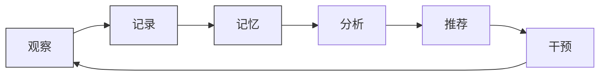
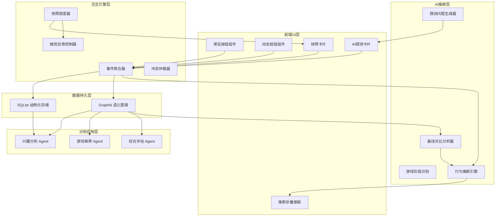
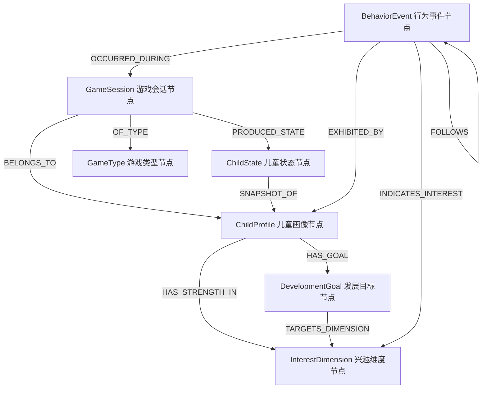
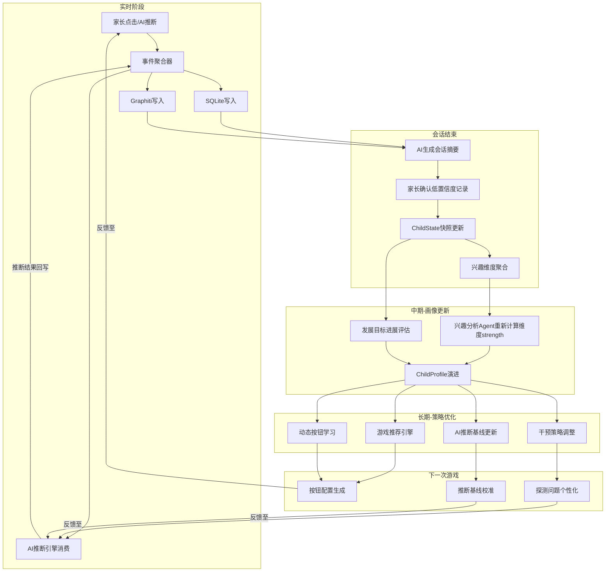
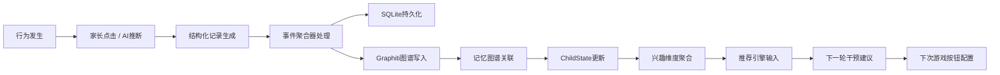
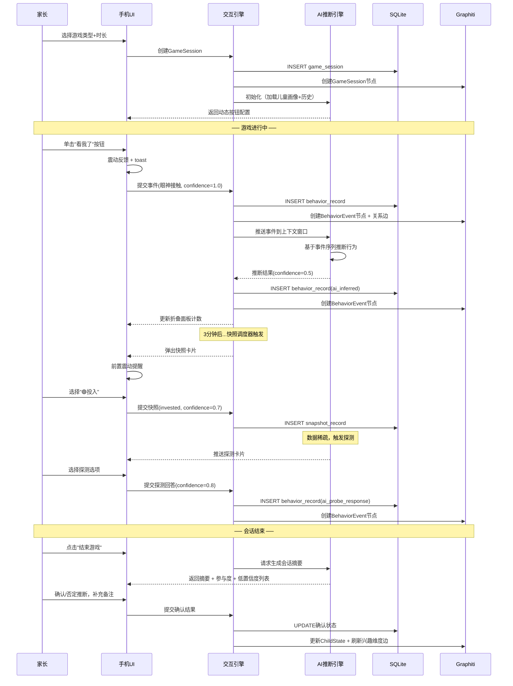
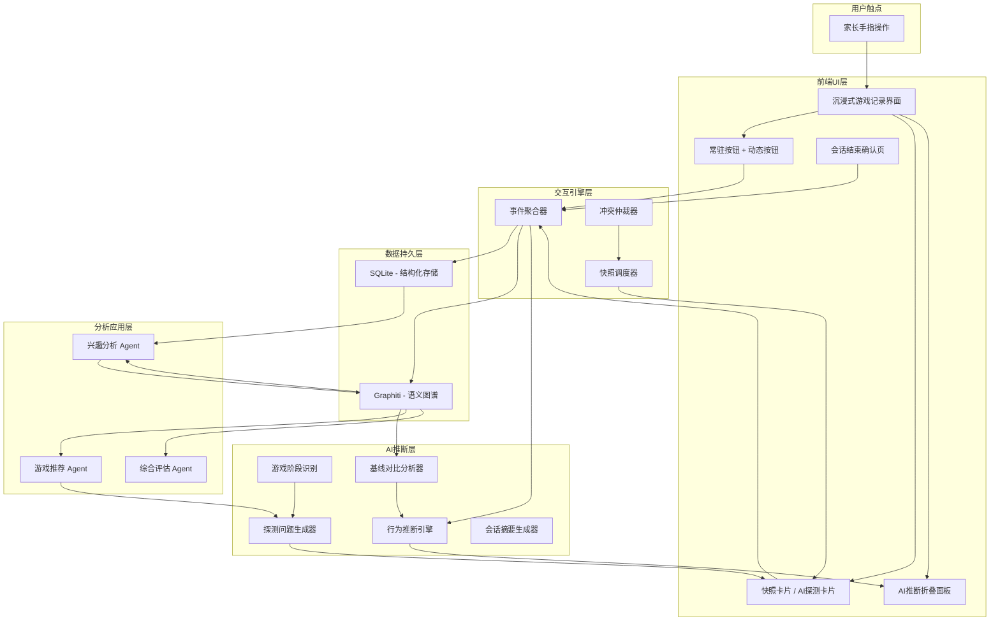

# 游戏会话实时行为记录系统设计文档

> **模块定位**：ASD_Agent 地板时光干预辅助系统 — 游戏实施阶段实时记录子系统  
> **版本**：v2.0  
> **最后更新**：2026-06-13

---

## 目录

1. [设计背景与目标](#1-设计背景与目标)
2. [设计原则](#2-设计原则)
3. [系统架构](#3-系统架构)
4. [人机交互设计（核心）](#4-人机交互设计核心)
5. [自适应定时快照机制](#5-自适应定时快照机制)
6. [AI 主动探测与推断系统](#6-ai-主动探测与推断系统)
7. [数据模型](#7-数据模型)
8. [Graphiti 记忆图谱设计](#8-graphiti-记忆图谱设计)
9. [记忆流向与干预闭环](#9-记忆流向与干预闭环)
10. [会话生命周期管理](#10-会话生命周期管理)
11. [历史数据智能利用](#11-历史数据智能利用)
12. [数据流图](#12-数据流图)
13. [技术约束与边界](#13-技术约束与边界)

---

## 1. 设计背景与目标

### 1.1 临床场景

DIR/Floortime（地板时光）是一种以关系为基础的发展性干预模式，要求家长在自然游戏情境中跟随孩子的兴趣引领，通过情感调谐促进儿童的社交-情绪发展。该模式的核心特点决定了记录的困难：

- **注意力不可分割**：家长需全程维持与孩子的情感连接，分心记录将直接破坏干预效果
- **行为转瞬即逝**：ASD 儿童的眼神接触、主动互动等关键行为往往只持续数秒
- **事后回忆失真**：游戏结束后的回忆性记录存在严重的记忆衰减和选择性偏差

### 1.2 核心矛盾

```
┌─────────────────────────────────────────────────────────┐
│                     核心设计矛盾                          │
│                                                         │
│   记录精度需求 ◄──── 对立 ────► 注意力零侵入需求          │
│                                                         │
│   • 需要时间戳级精度         • 家长眼睛不能离开孩子       │
│   • 需要事件类型细分         • 操作必须在1秒内完成        │
│   • 需要上下文关联           • 认知负荷必须趋近于零       │
│   • 需要连续性覆盖           • 不能打断游戏流程           │
└─────────────────────────────────────────────────────────┘
```

### 1.3 干预闭环定位（Intervention Loop）

本系统是 ASD 儿童干预完整闭环中 **"观察→记录→记忆"** 环节的关键实现：



**干预闭环的完整含义**：

| 环节 | 职责 | 承载系统 |
|------|------|----------|
| **观察** | 家长在游戏中感知孩子行为 | 家长本人 |
| **记录** | 将观察转化为结构化数据 | ★ **本系统**（实时记录子系统） |
| **记忆** | 数据持久化为可检索的知识图谱 | ★ **本系统** → Graphiti |
| 分析 | 从记忆中提炼发展趋势与模式 | 兴趣分析 Agent / 综合评估 Agent |
| 推荐 | 基于分析生成个性化游戏方案 | 游戏推荐 Agent |
| 干预 | 家长执行推荐的游戏方案 | 家长+系统引导 |

本系统的核心使命是：**通过极低认知负荷的人机交互设计，让高质量行为数据可靠地流入记忆系统，从而驱动后续的分析、推荐与干预决策，形成持续优化的闭环。**

数据质量直接决定闭环效果——如果"观察→记录→记忆"环节数据稀疏或失真，后续所有 AI 分析和推荐都将建立在不可靠的基础上。这正是本系统在整个产品中的战略价值所在。

### 1.4 解决策略

采用 **"快捷按钮 + 自适应定时快照 + AI 智能补全"** 三层递进式记录架构：

| 层次 | 机制 | 认知负荷 | 数据精度 | 覆盖率 |
|------|------|----------|----------|--------|
| L1 | 家长主动点击 | 极低（肌肉记忆） | 最高（confidence=1.0） | 离散事件 |
| L2 | 定时快照提醒 | 低（三选一） | 高（confidence=0.7） | 定时填充 |
| L3 | AI 推断补全 | 零（后台运行） | 中（confidence=0.5） | 连续覆盖 |

三层协同确保在不增加家长负担的前提下，实现近乎完整的行为时间线重建。

---

## 2. 设计原则

### 2.1 首要原则：注意力守恒

> 系统的一切交互设计必须服从一个不可妥协的约束：**家长的注意力属于孩子，而非屏幕。**

- **零视觉依赖**：所有按钮操作不需要看屏幕即可完成（固定位置 + 触觉反馈）
- **零认知决策**：快照问答为预设选项，不需要组织语言
- **零时序压力**：漏记不会产生数据断层，AI 层兜底补全

### 2.2 渐进式精度

系统不追求每一条记录都达到最高精度，而是接受置信度梯度。低置信度数据在会话结束时由家长快速确认/修正，形成"先粗后精"的数据闭环。

### 2.3 情境感知适应

系统根据游戏进行状态动态调整自身行为：
- 家长操作密集 → 系统安静（已有足够数据）
- 数据长时间空白 → 系统主动提醒（可能遗漏关键行为）
- 游戏阶段转换 → 系统调整关注焦点（探索期关注兴趣线索，互动期关注社交行为）

### 2.4 容错优先

- 误触可撤销（最近一条记录 3 秒内可取消）
- 漏记可补录（时间线支持回溯插入）
- AI 错误可否定（一键标记推断错误）

### 2.5 专业性与易用性平衡

按钮标签使用家长可理解的日常语言（"看我了""自己玩起来了"），底层数据模型映射到专业的 DIR 维度体系，兼顾家长的使用体验与专业数据分析需求。

---

## 3. 系统架构

### 3.1 分层架构图



### 3.2 核心组件职责

| 组件 | 层级 | 职责 |
|------|------|------|
| 事件聚合器 | 交互引擎 | 统一时间戳、来源标记、置信度赋值、去重合并 |
| 快照调度器 | 交互引擎 | 根据点击密度动态调整快照频率 |
| 冲突仲裁器 | 交互引擎 | 处理多个UI元素同时需要展示时的优先级 |
| 行为推断引擎 | AI层 | 基于事件序列和儿童画像进行行为推断 |
| 探测问题生成器 | AI层 | 结合游戏阶段和发展目标生成个性化问题 |
| 基线对比分析器 | AI层 | 实时对比当前数据与历史基线，标记异常 |

---

## 4. 人机交互设计（核心）

### 4.1 界面整体布局

游戏记录界面采用 **全屏沉浸式布局**，最大化按钮触控区域，最小化视觉干扰。

```
┌─────────────────────────────────────┐
│  ◀ 搭积木 · 15:32    ⏱ 12:45  ⚙  │  ← 状态栏（游戏类型·时间·设置）
├─────────────────────────────────────┤
│                                     │
│  ┌─────────────────────────────┐    │
│  │  🤖 AI已记录 3 条  ▼展开    │    │  ← AI推断折叠面板指示器
│  └─────────────────────────────┘    │
│                                     │
│                                     │
│         （ 留 白 区 域 ）            │  ← 视觉呼吸空间，降低焦虑
│      家长注意力应在孩子身上           │
│                                     │
│                                     │
│                                     │
├─────────────────────────────────────┤
│                                     │
│  ┌─────────┐ ┌─────────┐ ┌─────┐  │  ← 动态按钮区（2-3个）
│  │  模 仿  │ │  轮 流  │ │  +  │  │
│  └─────────┘ └─────────┘ └─────┘  │
│                                     │
│  ┌────────┐┌────────┐┌────┐┌────┐  │  ← 常驻按钮区（4个）
│  │ 👁 看我 ││ 🤝 互动 ││ 😊 ││ 😟 │  │
│  │  了    ││  起来  ││正面││负面│  │
│  └────────┘└────────┘└────┘└────┘  │
│                                     │
│  ━━━━━━━━━━━━━━━━━━━━━━━━━━━━━━━━━  │  ← 安全底边距（防误触Home键）
└─────────────────────────────────────┘
```

**布局设计决策**：
- 屏幕上方 2/3 为"留白 + AI面板"，暗示家长不必盯着手机
- 屏幕下方 1/3 为操作区，支持单手拇指触达所有按钮
- 按钮位置绝对固定，形成肌肉记忆后可盲操

### 4.2 常驻按钮设计

#### 4.2.1 按钮定义

常驻按钮代表地板时光中**普遍关注的核心行为维度**，不随游戏类型变化：

| 按钮 | 标签 | 映射事件 | 色彩 | 长按二级选项 |
|------|------|----------|------|--------------|
| 👁 | 看我了 | 眼神接触 | 蓝色 | 短暂一瞥 / 持续注视 / 共同注意 |
| 🤝 | 互动起来 | 主动互动 | 绿色 | 主动发起 / 被动回应 / 拒绝互动 |
| 😊 | 正面 | 情绪正面 | 暖黄 | 微笑 / 大笑 / 兴奋 / 满足 |
| 😟 | 负面 | 情绪负面 | 橙红 | 烦躁 / 哭泣 / 退缩 / 发脾气 |

#### 4.2.2 布局与尺寸原则

- 前两个按钮（眼神接触、互动）尺寸略大 —— 它们是地板时光最高频记录的行为
- 按钮尺寸根据该儿童的历史点击频率动态微调（高频按钮视觉权重更大）
- 所有按钮触控热区不小于无障碍标准（WCAG 最小触控面积）
- 按钮间保持足够间距，防止相邻误触

#### 4.2.3 交互反馈机制

**单击流程**：

```
手指触摸 → 按钮缩放动画 → 短震动反馈 → 事件写入 → 底部微型toast"已记录✓"(1.5s消失)
```

**长按流程**（持续按压 >300ms）：

```
持续按压 → 强震动 → 底部弹出二级选项面板（半透明遮罩） → 选择后收起 → 写入详细事件
```

**长按展开面板示意**：

```
┌─────────────────────────────────────┐
│           （半透明遮罩）              │
│                                     │
│  ┌─────────────────────────────┐    │
│  │      🤝 互动 - 选择细节      │    │
│  │                             │    │
│  │  ┌────────┐ ┌────────┐     │    │
│  │  │ 主动   │ │ 被动   │     │    │
│  │  │ 发起   │ │ 回应   │     │    │
│  │  └────────┘ └────────┘     │    │
│  │       ┌────────┐           │    │
│  │       │ 拒绝   │           │    │
│  │       │ 互动   │           │    │
│  │       └────────┘           │    │
│  └─────────────────────────────┘    │
│                                     │
│  ┌────────┐┌────────┐┌────┐┌────┐  │
│  │ 👁 看我 ││ 🤝 互动 ││ 😊 ││ 😟 │  │
│  └────────┘└────────┘└────┘└────┘  │
└─────────────────────────────────────┘
```

#### 4.2.4 撤销机制

每次点击后，toast 右侧附带"撤销"按钮，3 秒内点击可撤销本次记录。超时后 toast 消失，记录确认写入。

### 4.3 动态按钮设计

#### 4.3.1 生成逻辑

动态按钮在会话开始时由 AI 根据以下信息生成 2-3 个：
- 本次游戏类型
- 该儿童在同类游戏中的历史高频行为 TOP3
- 当前阶段的发展目标

#### 4.3.2 游戏类型与动态按钮映射示例

| 游戏类型 | 典型动态按钮 | 行为意义 |
|----------|--------------|----------|
| 搭积木 | 模仿 / 轮流 / 破坏 | 建构游戏中的核心社交行为 |
| 追逐游戏 | 主动发起 / 跟随 / 逃避 | 运动游戏中的主被动角色 |
| 角色扮演 | 假装动作 / 语言表达 / 角色切换 | 象征性游戏的发展指标 |
| 感官探索 | 主动触碰 / 回避 / 重复 | 感官调节行为模式 |
| 音乐律动 | 节奏跟随 / 自发舞动 / 停顿等待 | 听觉-运动协调指标 |

#### 4.3.3 自定义按钮

动态按钮区域末尾固定一个 `[+]` 按钮：

```
┌─────────┐ ┌─────────┐ ┌─────┐
│  模 仿  │ │  轮 流  │ │  +  │  ← 点击弹出快速输入
└─────────┘ └─────────┘ └─────┘
                              │
                              ▼
                    ┌──────────────────┐
                    │ 添加观察按钮      │
                    │                  │
                    │ 近期常用:         │
                    │ [发出声音] [指向] │
                    │                  │
                    │ 或输入:__________ │
                    │     [确定]       │
                    └──────────────────┘
```

- 优先展示"近期常用"的自定义标签，支持一键选取
- 支持自由文字输入（极短文本，建议2-4字）
- 新增按钮在本次会话内持续生效
- 累计添加的自定义按钮如在多次会话中重复出现，系统自动提升其为动态按钮候选

### 4.4 定时快照交互

#### 4.4.1 快照弹窗设计

快照以非阻塞式卡片形式从顶部滑入，**不覆盖底部操作区**：

```
┌─────────────────────────────────────┐
│  ◀ 搭积木 · 15:32    ⏱ 12:45  ⚙  │
├─────────────────────────────────────┤
│                                     │
│  ┌─────────────────────────────┐    │
│  │  现在孩子的状态？            │    │
│  │                             │    │
│  │  🟢 投入    🟡 一般    🔴 脱离 │    │
│  │                             │    │
│  │            [跳过]           │    │
│  └─────────────────────────────┘    │
│                                     │
│                                     │
│  ┌─────────┐ ┌─────────┐ ┌─────┐  │  ← 按钮区保持可用
│  │  模 仿  │ │  轮 流  │ │  +  │  │
│  ┌────────┐┌────────┐┌────┐┌────┐  │
│  │ 👁 看我 ││ 🤝 互动 ││ 😊 ││ 😟 │  │
│  └────────┘└────────┘└────┘└────┘  │
└─────────────────────────────────────┘
```

**关键设计决策**：
- 快照卡片出现时底部按钮**仍然可用** —— 如果此刻恰好发生需记录的行为，家长不必先处理快照
- 快照卡片 15 秒无响应自动收起（视为"跳过"）
- 跳过不惩罚 —— 系统不会因跳过而更频繁弹出

#### 4.4.2 触觉前置提示

快照弹出前 1 秒触发轻微震动，给家长心理预期，避免突然弹出的惊扰感。

### 4.5 AI 探测卡片交互

#### 4.5.1 卡片形态

AI 探测卡片比快照更具上下文感知性，问题基于当前游戏阶段和儿童发展目标生成：

```
┌─────────────────────────────────────┐
│                                     │
│  ┌─────────────────────────────┐    │
│  │  🤖 AI 想确认：              │    │
│  │                             │    │
│  │  刚才孩子搭的塔倒了，       │    │
│  │  他的反应是？               │    │
│  │                             │    │
│  │  ┌──────┐ ┌──────┐         │    │
│  │  │ 大笑 │ │ 再搭 │         │    │
│  │  └──────┘ └──────┘         │    │
│  │  ┌──────┐ ┌──────┐         │    │
│  │  │ 走开 │ │ 发脾气│         │    │
│  │  └──────┘ └──────┘         │    │
│  │                             │    │
│  │         [不确定/跳过]        │    │
│  └─────────────────────────────┘    │
│                                     │
└─────────────────────────────────────┘
```

#### 4.5.2 探测问题生成策略

AI 探测遵循 DIR/Floortime 的游戏阶段理论，在不同阶段聚焦不同维度：

| 游戏阶段 | 时间占比 | AI 关注焦点 | 典型探测问题 |
|----------|----------|-------------|--------------|
| 探索期 | 前20% | 兴趣线索、感官偏好 | "孩子对哪个玩具最感兴趣？" |
| 互动期 | 中间50% | 社交回应、共同注意 | "你们有来回互动吗？" |
| 高潮期 | 10-20% | 情绪峰值、突破行为 | "刚才那个时刻孩子的情绪怎样？" |
| 收尾期 | 后10-20% | 转换能力、分离反应 | "结束游戏时孩子的反应？" |

#### 4.5.3 频率自适应规则

| 家长活跃度（最近5分钟） | AI探测频率 | 设计意图 |
|--------------------------|------------|----------|
| ≥4次点击 | 极低（仅阶段转换时） | 家长已在主动记录，AI不打扰 |
| 1-3次点击 | 正常（每5-7分钟一次） | 补充家长可能遗漏的维度 |
| 0次点击 | 提升（每3-4分钟一次） | 数据稀疏，主动补问 |

### 4.6 AI 实时推断折叠面板

#### 4.6.1 折叠态（默认）

```
┌─────────────────────────────────────┐
│  ┌─────────────────────────────┐    │
│  │  🤖 AI已记录 5 条  ▼        │    │  ← 单行指示器，点击展开
│  └─────────────────────────────┘    │
```

折叠指示器实时更新计数，让家长知道"即使我没操作，系统也在工作"，减轻记录焦虑。

#### 4.6.2 展开态

```
┌─────────────────────────────────────┐
│  ┌─────────────────────────────┐    │
│  │  🤖 AI实时推断  ▲收起        │    │
│  │                             │    │
│  │  ───── 时间线 ─────         │    │
│  │                             │    │
│  │  15:33 ┃ 🟢 孩子主动拿起积木│ ✓✗│
│  │  15:35 ┃ 🟢 模仿家长的搭法  │ ✓✗│
│  │  15:37 ┃ 🟡 注意力短暂转移  │ ✓✗│
│  │  15:39 ┃ ┄┄ 可能在观察家长 ┄┄│ ✓✗│  ← 虚线=低置信度
│  │  15:41 ┃ 🟢 眼神接触后微笑  │ ✓✗│
│  │                             │    │
│  │  ● 绿=积极 ● 黄=中性 ● 红=需关注│
│  └─────────────────────────────┘    │
```

**交互细节**：
- `✓` 点击确认该推断正确 → 置信度提升至 0.9
- `✗` 点击否定该推断 → 标记为无效，不计入分析
- 低置信度条目使用虚线边框 + 半透明文字
- 展开面板最多显示最近 8 条，可滚动查看更多
- 面板展开时底部按钮仍可操作（面板仅占上半屏）

#### 4.6.3 颜色编码语义

| 颜色 | 语义 | 对应行为举例 |
|------|------|--------------|
| 🟢 绿色 | 积极行为 | 主动互动、眼神接触、正面情绪、模仿、共同注意 |
| 🟡 黄色 | 中性行为 | 独自探索、注意力转移、被动参与、观察 |
| 🔴 红色 | 需关注 | 情绪崩溃、持续回避、刻板行为加剧、完全脱离 |
| ┄┄ 虚线 | 低置信度 | confidence < 0.6 的推断，需家长确认 |

### 4.7 操作时序与冲突处理

当多个 UI 元素同时需要交互时，系统遵循以下优先级：

| 优先级 | 交互类型 | 冲突规则 |
|--------|----------|----------|
| 1（最高） | 家长主动点击按钮 | 永远优先响应 |
| 2 | 长按二级面板交互 | 出现时冻结快照弹出 |
| 3 | AI探测卡片 | 如与快照冲突则排队 |
| 4（最低） | 定时快照 | 如家长正在操作则延迟5秒 |

### 4.8 无障碍与极端场景

| 场景 | 系统行为 |
|------|----------|
| 家长全程未点击任何按钮 | AI 推断层全量覆盖，快照频率提升至每 2 分钟，结束时提供完整推断时间线供确认 |
| 家长疯狂点击（>10次/分钟） | 可能为误触，弹出"需要暂停记录吗？"确认 |
| 游戏意外中断（来电等） | 自动暂停计时，恢复后 AI 询问"中断期间有变化吗？" |
| 手机锁屏 | 暂停所有记录，解锁后恢复并标记中断时段 |

---

## 5. 自适应定时快照机制

### 5.1 频率控制策略

快照调度器维护三种工作模式，根据家长操作密度动态切换：

| 模式 | 快照间隔 | 触发条件 | 附加行为 |
|------|----------|----------|----------|
| **正常模式** | 3 分钟 | 会话开始默认状态 | 无 |
| **密集模式** | 5 分钟 | 5分钟内 ≥4 次点击 | 家长已在主动记录，降低打扰 |
| **稀疏模式** | 2 分钟 | 连续4分钟无任何操作 | 触发震动提醒 |

模式切换为双向可逆——当家长恢复正常点击频率后，自动回到正常模式。

### 5.2 震动提醒策略

数据稀疏时的提醒采用**递减打扰**策略：
- 第 1 次：正常震动 + 快照弹出
- 第 2 次：轻微震动 + 快照弹出
- 第 3 次起：仅快照弹出，不震动（避免反复打扰造成家长烦躁）

---

## 6. AI 主动探测与推断系统

### 6.1 推断引擎工作原理

AI 推断引擎在后台持续运行，消费事件聚合器产出的事件流，结合上下文进行行为推断：

**输入信号**：家长点击事件序列、快照回答序列、游戏类型与当前阶段、儿童历史画像（兴趣维度/发展目标）、最近一次AI探测的回答

**输出**：推断文本（一句话描述）、行为类别、效价（正/中/负）、置信度（0.3-0.7）、推断依据

### 6.2 游戏阶段自动识别

系统根据会话时间进度和行为模式自动判断游戏阶段：

- **探索期**（前20%时间）：孩子在熟悉环境和材料
- **互动期**（中间50%）：核心互动阶段，检测高密度互动行为
- **高潮期**（动态识别）：检测到情绪峰值或密集互动事件时标记
- **收尾期**（后15-20%）：游戏即将结束，关注转换能力

阶段识别用于指导 AI 探测问题的生成方向和推断引擎的关注焦点。

### 6.3 探测问题个性化

探测问题结合儿童档案动态生成，而非使用通用模板：

- 基于儿童发展目标（如"共同注意""情绪调节"）确定关注重点
- 当某维度数据缺失时主动探测该维度
- 问题描述使用家长可观察的具体行为描述，而非抽象专业术语
- 选项预设为2-4个典型回答 + "不确定/跳过"

---

## 7. 数据模型

### 7.1 核心实体

#### BehaviorRecord（行为记录）

系统的原子数据单元，每条记录代表一个离散的行为事件或状态观察：

| 字段 | 含义 | 取值说明 |
|------|------|----------|
| timestamp | 事件发生时间 | 精确到秒 |
| session_id | 所属游戏会话 | 关联 GameSession |
| game_type | 游戏类型 | 搭积木/追逐/角色扮演等 |
| event_type | 事件类型 | 眼神接触/主动互动/情绪变化等 |
| detail | 二级细节 | 如"持续注视""主动发起"，可为空 |
| valence | 情感效价 | +1正面 / 0中性 / -1负面 |
| source | 数据来源 | parent_click / timed_snapshot / ai_probe_response / ai_inferred |
| confidence | 置信度 | 1.0(家长主动) / 0.7(快照) / 0.5(AI推断) |
| game_phase | 游戏阶段 | 探索 / 互动 / 高潮 / 收尾 |
| related_interest | 关联兴趣维度 | 对应八维体系（Visual/Motor/Social等） |
| is_confirmed | 是否已确认 | AI推断专用，会话结束时家长确认 |

#### GameSession（游戏会话）

一次完整游戏的元数据容器：

| 字段 | 含义 |
|------|------|
| session_id | 会话唯一标识 |
| child_id | 关联儿童 |
| game_type | 游戏类型 |
| start_time / end_time | 起止时间 |
| planned_duration / actual_duration | 计划/实际时长 |
| dynamic_buttons | 本次动态按钮列表 |
| ai_summary | AI生成的会话摘要 |
| engagement_score | 整体参与度得分 (0-100) |
| parent_notes | 家长补充备注 |

#### SnapshotRecord（快照记录）

定时快照的回答记录：engagement_level（投入/一般/脱离）、是否被跳过、当时调度器模式。

### 7.2 双写存储策略

| 存储 | 定位 | 写入方式 | 核心用途 |
|------|------|----------|----------|
| **SQLite** | 结构化本地存储 | 同步写入（主路径） | 时序查询、统计分析、离线可用 |
| **Graphiti** | 语义知识图谱 | 异步写入（后台队列） | 语义检索、跨时间关联、Agent上下文 |

设计保证：
- SQLite 写入为主路径，必须成功
- Graphiti 写入为异步旁路，失败不影响核心记录功能
- 本地 SQLite 作为 Graphiti 的可靠备份源和离线降级方案

---

## 8. Graphiti 记忆图谱设计

### 8.1 节点类型定义



### 8.2 节点详细说明

| 节点类型 | 含义 | 核心属性 | 生命周期 |
|----------|------|----------|----------|
| **BehaviorEvent** | 单条行为事件 | timestamp, event_type, valence, confidence, source | 每次家长点击/AI推断时创建 |
| **GameSession** | 一次游戏会话 | game_type, duration, engagement_score, summary | 会话开始时创建，结束时更新 |
| **ChildState** | 儿童阶段性状态快照 | 各维度strength值, 整体发展阶段 | 每次会话结束后由聚合器更新 |
| **ChildProfile** | 儿童长期画像（实体） | 基本信息, 诊断信息 | 首次录入时创建，持续演进 |
| **InterestDimension** | 八维兴趣维度 | dimension_name, current_strength, exploration_level | 系统预置，数值持续更新 |
| **DevelopmentGoal** | 发展目标 | goal_description, target_level, current_progress | 评估后设定，定期调整 |
| **GameType** | 游戏类型注册 | type_name, typical_behaviors, recommended_buttons | 系统预置+动态学习 |

### 8.3 关系边定义

| 关系 | 起点 → 终点 | 含义 | 携带属性 |
|------|-------------|------|----------|
| OCCURRED_DURING | BehaviorEvent → GameSession | 事件发生在某次会话中 | — |
| EXHIBITED_BY | BehaviorEvent → ChildProfile | 行为归属于某个儿童 | — |
| INDICATES_INTEREST | BehaviorEvent → InterestDimension | 行为指示某兴趣维度 | weight（关联强度） |
| FOLLOWS | BehaviorEvent → BehaviorEvent | 时序上的前后关系 | interval_seconds |
| BELONGS_TO | GameSession → ChildProfile | 会话归属 | — |
| OF_TYPE | GameSession → GameType | 游戏分类 | — |
| PRODUCED_STATE | GameSession → ChildState | 会话产出的状态快照 | — |
| SNAPSHOT_OF | ChildState → ChildProfile | 状态归属画像 | valid_at, invalid_at |
| HAS_STRENGTH_IN | ChildProfile → InterestDimension | 画像在某维度的兴趣强度 | strength, exploration |
| HAS_GOAL | ChildProfile → DevelopmentGoal | 当前发展目标 | priority, set_date |
| TRIGGERED_BY | BehaviorEvent → BehaviorEvent | 因果推断关系 | AI推断→触发事件 |

### 8.4 写入时机与触发条件

| 触发事件 | 写入内容 | 时机 |
|----------|----------|------|
| 家长单击按钮 | 创建 BehaviorEvent 节点 + OCCURRED_DURING/EXHIBITED_BY/INDICATES_INTEREST 边 | 实时（异步队列） |
| AI产出推断 | 创建 BehaviorEvent 节点（标记 source=ai_inferred） + TRIGGERED_BY 边 | 推断生成后入队 |
| 家长确认推断 | 更新 BehaviorEvent 的 confidence 属性 | 会话结束确认时 |
| 会话结束 | 创建/更新 ChildState 节点 + 更新 HAS_STRENGTH_IN 边的数值 | 会话结束闭环中 |
| 发展目标调整 | 创建/更新 DevelopmentGoal + HAS_GOAL 边 | 综合评估后 |

### 8.5 时序感知设计

Graphiti 的核心优势在于 `valid_at` / `invalid_at` 时间窗口机制：

- 每条 ChildState → ChildProfile 的 SNAPSHOT_OF 边携带时间戳
- 当新会话产出新状态时，旧状态边被标记 `invalid_at = now`
- 查询时可以精确获取"某个时间点的儿童状态"或"状态变化轨迹"
- 综合评估 Agent 可感知"3个月前回避触觉，近期已逐步接受"这类跨时间对比

---

## 9. 记忆流向与干预闭环

### 9.1 数据流转全景



### 9.2 四阶段流转说明

#### 短期：实时消费（游戏进行中）

事件写入后立即被 AI 推断引擎消费：
- 维持滑动窗口上下文（最近 N 条事件）
- 结合窗口内事件模式生成推断
- 驱动探测卡片的生成时机和问题内容
- 实时更新基线对比分析

#### 中期：画像更新（会话结束后）

会话结束闭环完成后触发：
- 兴趣分析 Agent 拉取本次会话全部 BehaviorRecord，重新计算各维度 strength/exploration
- ChildState 快照写入 Graphiti（携带 valid_at 时间戳）
- 如发现显著变化（某维度 strength 变化 >15），触发发展目标进展更新

#### 长期：策略优化（多次会话累积后）

历史数据积累达到统计意义后：
- 游戏推荐引擎利用兴趣图谱为下一次干预选择最优游戏类型
- 干预策略从"利用/探索/脱敏"三模式中自动选择
- 动态按钮候选列表根据历史高频行为持续学习
- AI 推断模型的基线参数根据该儿童特征校准

#### 闭环：反馈至下一次游戏

长期优化的结果直接影响下一次游戏会话的配置：
- **按钮配置**：高频行为按钮更大/更靠前，动态按钮个性化
- **探测问题**：聚焦当前发展目标的弱项维度
- **推断基线**：基于该儿童特有的行为模式校准推断阈值
- **游戏推荐**：基于兴趣演进曲线推荐最适合当前阶段的游戏

---

## 10. 会话生命周期管理

### 10.1 完整生命周期

```
会话准备 ───► 游戏进行 ───► 结束确认 ───► 数据确认 ───► 存储归档
  │              │              │              │              │
• 选择游戏      • 按钮记录     • AI摘要       • 确认推断      • 双写完成
• 确认时长      • 快照采集     • 参与度       • 补充备注      • 画像更新
• 动态按钮生成  • AI推断       • 低置信度列表  •              • 索引更新
               • 阶段推进
```

### 10.2 会话开始流程

```
┌─────────────────────────────────────┐
│         开始新游戏会话               │
├─────────────────────────────────────┤
│                                     │
│  今天要玩什么？                      │
│                                     │
│  ┌──────┐ ┌──────┐ ┌──────┐       │
│  │搭积木│ │追逐  │ │画画  │       │
│  └──────┘ └──────┘ └──────┘       │
│  ┌──────┐ ┌──────┐ ┌──────┐       │
│  │ 音乐 │ │ 沙盘 │ │ 其他 │       │
│  └──────┘ └──────┘ └──────┘       │
│                                     │
│  计划玩多久？                        │
│  ○ 10分钟  ● 20分钟  ○ 30分钟      │
│                                     │
│         [ 开始记录 ]                 │
└─────────────────────────────────────┘
```

### 10.3 会话结束闭环

家长点击结束按钮后，进入结束闭环流程：

```
┌─────────────────────────────────────┐
│         📋 本次游戏小结              │
├─────────────────────────────────────┤
│                                     │
│  ⏱ 时长：18分钟                     │
│  📊 参与度：▓▓▓▓▓▓▓░░░ 72%        │
│                                     │
│  AI摘要：                           │
│  "小明今天搭积木时有3次主动眼神       │
│   接触，比上次增加1次。中期出现       │
│   模仿行为，但后段注意力下降。"       │
│                                     │
│  ─── 需确认的推断 ───               │
│                                     │
│  15:37 "注意力短暂转移"    [✓] [✗]  │
│  15:39 "可能在观察家长"    [✓] [✗]  │
│  15:44 "对新积木好奇"     [✓] [✗]  │
│                                     │
│  ┌────────────────────────────┐     │
│  │ 想补充什么吗？（选填）      │     │
│  │ _________________________  │     │
│  └────────────────────────────┘     │
│                                     │
│  [确认并保存]      [我要补充更多]    │
└─────────────────────────────────────┘
```

**闭环设计要点**：
- 低置信度推断（<0.6）集中呈现，家长批量确认
- 参与度进度条给予家长即时的正向反馈
- AI 摘要突出**与历史对比的进步**，增强家长坚持动力
- "我要补充更多"允许家长添加系统未捕捉到的关键时刻

---

## 11. 历史数据智能利用

### 11.1 按钮排序与尺寸自适应

系统根据历史数据动态调整按钮的视觉权重：
- 统计该儿童在同类游戏中各事件类型的历史点击频率
- 高频按钮：视觉尺寸更大，位置更靠左（拇指易触达区）
- 低频按钮：标准尺寸，位置靠右
- 首次使用时所有按钮均匀排布，数据积累后逐步分化

### 11.2 动态按钮学习

系统持续统计家长在同类游戏中的自定义按钮使用情况：
- 某自定义标签在 ≥3 次会话中被重复添加 → 自动提升为动态按钮候选
- 某动态按钮连续 5 次会话从未被点击 → 降低其优先级
- 学习结果在下一次同类游戏会话开始时生效

### 11.3 基线对比与异常标记

AI 持续将当前会话数据与该儿童的历史基线对比，发现显著偏离时在推断面板中标记：

- **正向偏离**（⚡ 绿色）：某行为频率显著高于历史均值
- **负向偏离**（⚠️ 黄色）：某行为频率显著低于历史
- **新行为出现**（🆕）：历史中从未记录过的行为首次出现

这些标记帮助家长即时感知孩子的变化，也作为后续分析的重要输入信号。

---

## 12. 数据流图

### 12.1 单个行为事件完整生命周期



### 12.2 典型游戏会话时序图



### 12.3 系统整体架构图



---

## 13. 技术约束与边界

### 13.1 硬性约束

| 约束项 | 说明 |
|--------|------|
| 目标设备 | 手机端（Android/iOS），无桌面端需求 |
| 输入模态 | 仅触控，不使用音频/视频/语音输入 |
| 网络依赖 | 核心记录功能离线可用（SQLite 本地存储），Graphiti 写入需网络 |
| AI处理 | 伪实时（批量处理可接受 1-3 秒延迟），非严格实时 |
| 单手操作 | 界面布局必须支持单手持机操作（按钮在下半屏） |

### 13.2 性能目标

| 指标 | 目标值 | 说明 |
|------|--------|------|
| 按钮响应延迟 | <50ms | 触觉反馈到事件写入 |
| 快照弹出延迟 | <200ms | 从调度触发到UI可见 |
| AI推断延迟 | <3s | 从事件发生到推断产出 |
| 电池消耗 | <5%/30min | 游戏会话期间增量 |

### 13.3 设计边界（不在本系统范围内）

- 行为视频录制与分析
- 家长语音输入转录
- 多设备协同（如家长+治疗师同时记录）
- 实时远程监控
- 自动化干预建议生成（由分析应用层的其他 Agent 负责）

---

## 附录 A：术语表

| 术语 | 定义 |
|------|------|
| DIR/Floortime | 发展性个体差异关系为基础的干预模式 |
| Episode | Graphiti 中的一个语义单元，对应一次完整游戏会话 |
| 置信度 (confidence) | 0-1 之间的数值，表示某条记录的可靠程度 |
| 游戏阶段 | 地板时光中的自然阶段划分：探索→互动→高潮→收尾 |
| 事件聚合器 | 统一处理不同来源事件的中间层组件 |
| 基线对比 | 当前会话数据与该儿童历史同类游戏数据的统计对比 |
| 干预闭环 | 观察→记录→记忆→分析→推荐→干预→观察 的循环 |

## 附录 B：与现有系统的集成点

| 对接系统 | 集成方式 | 数据流向 |
|----------|----------|----------|
| Graphiti 记忆系统 | 异步写入 BehaviorEvent/GameSession 节点 | 本系统 → Graphiti |
| 兴趣分析 Agent | 会话结束后触发维度聚合 | 本系统 → Agent → Graphiti |
| 游戏推荐 Agent | 读取历史会话数据+兴趣图谱 | Graphiti → Agent → 下次游戏配置 |
| 综合评估 Agent | 拉取多次会话记录生成报告 | Graphiti/SQLite → Agent |
| Supervisor Agent | 在对话中触发游戏记录流程 | Supervisor → 本系统 |
