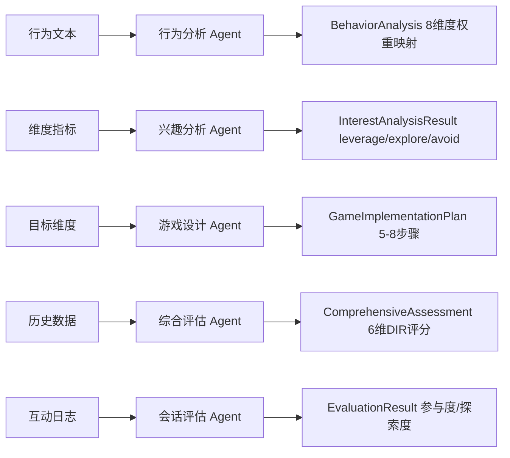
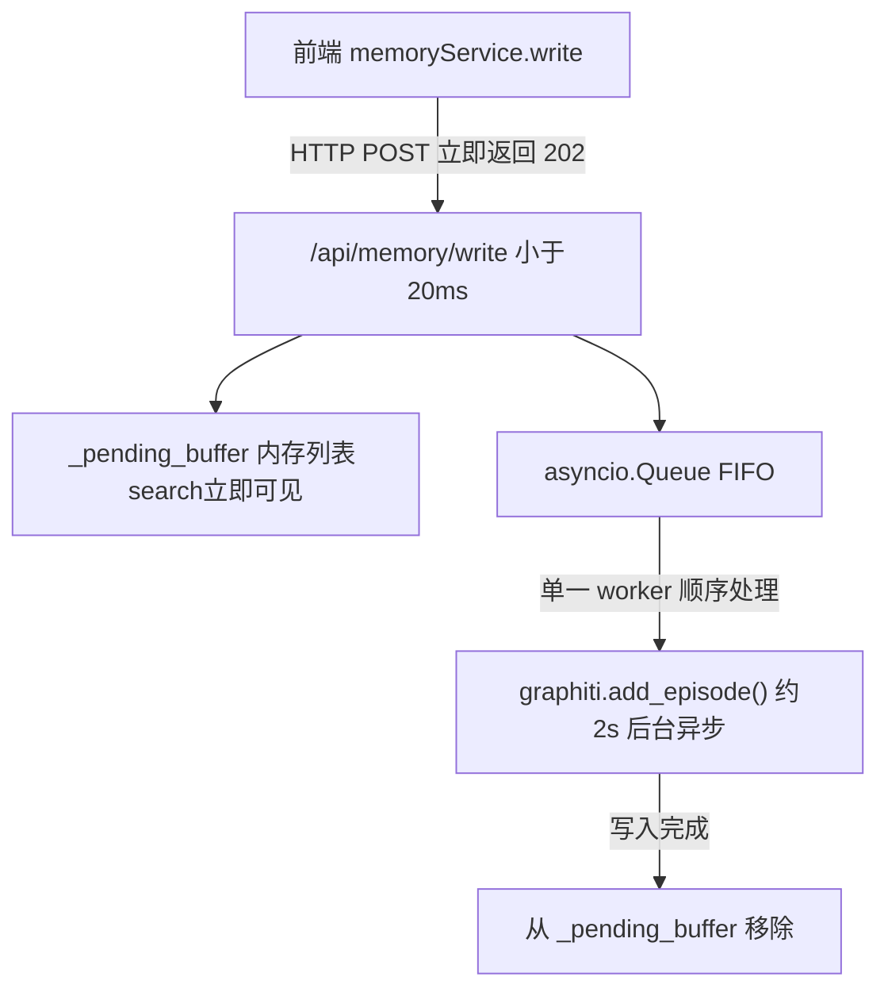
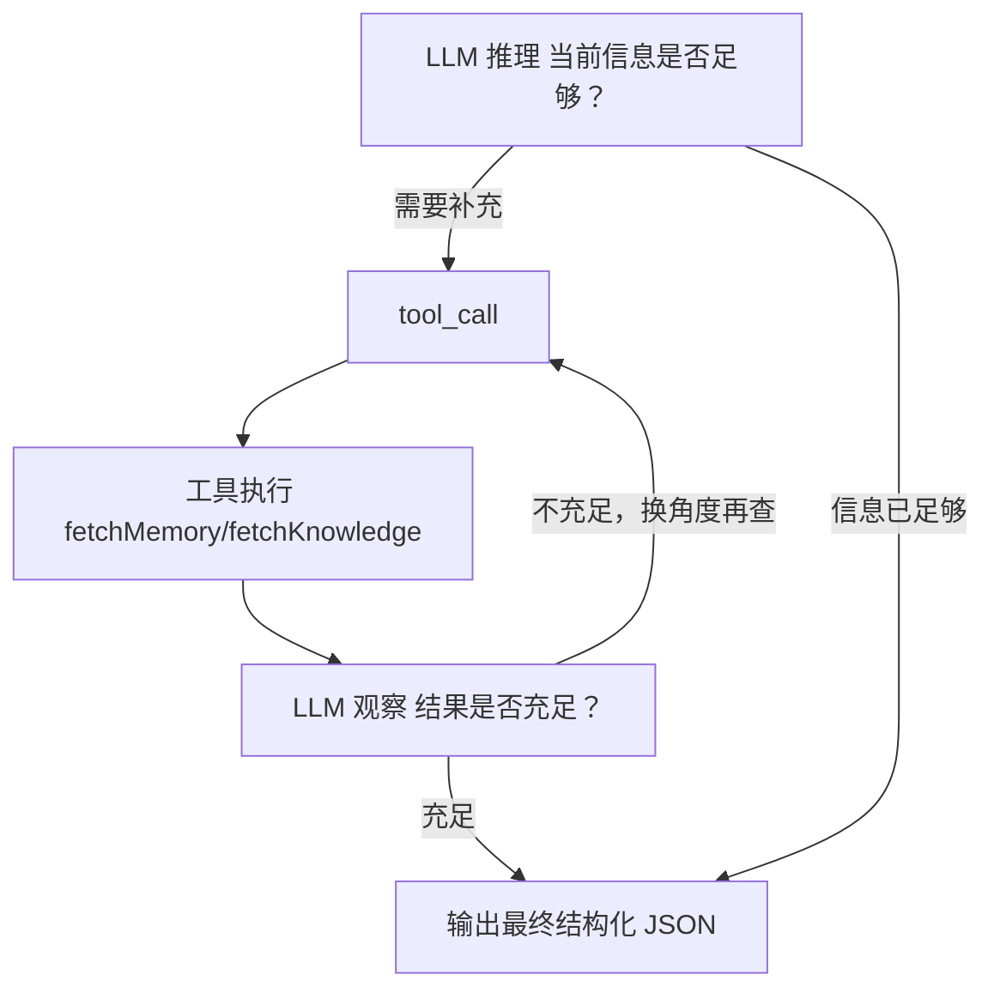
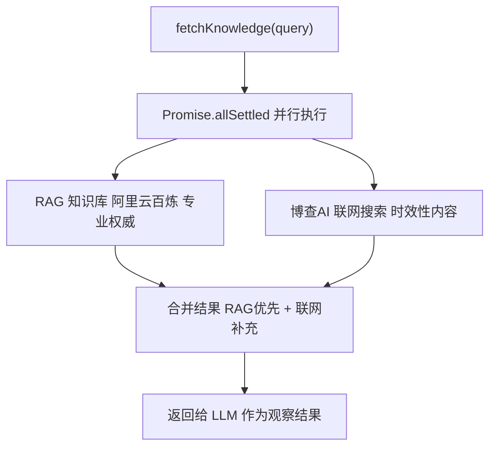

# 技术架构与创新

## 基于Supervisor的Multi-Agents架构与交互创新

### 层次化 Multi-Agents 架构构建

系统采用两层 Agent 结构：

**Supervisor Agent（对话规划层）**：基于 Qwen3-Omni-Flash，通过 SSE Function Calling 与家长实时对话，自动判断意图并调度子 Agent。定义 5 个工具：`analyze_interest`（兴趣分析）、`plan_floor_game`（游戏设计）、`log_behavior`（行为记录）、`generate_assessment`（综合评估），以及 `navigate_page`（直接由路由状态处理，不涉及子 Agent）。

**专职子 Agent（专业执行层）**：各 Agent 底层统一调用 `qwenStreamClient`，通过 JSON Schema 约束结构化输出：



### 基于共享黑板的多智能体通信框架

Agent 间不直接通信，通过**共享黑板**异步协作，分为两层：

**结构化数据层（localStorage）**：各 Agent 向黑板读入上下文、写入结果，互不感知。`sessionStorage` 的 `interest_analysis_context` 键专用于两步推荐的跨步骤中间态传递。

**非结构化记忆层（Graphiti 图谱）**：游戏、行为、评估等关键事件异步提炼为带时间戳的语义事实（Fact）写入图谱。任意子 Agent 执行前可通过 `fetchMemoryFacts(query)` 检索历史事实，实现跨时间维度的上下文感知，弥补 localStorage 快照的时效局限。

两层分工明确：结构化层保障当前状态一致性，图谱层提供长期语义记忆。

### 交互创新

本系统的核心创新在于 **Supervisor 直接嵌入聊天界面，同时承担 Chatbot 和规划师两种身份**，实现"对话即规划"：

家长用自然语言表达需求，Supervisor 在流式输出回复的同时自动触发子 Agent，分析结果以交互卡片的形式渲染在对话气泡中——整个专业分析过程对家长透明且无缝。

游戏推荐设计为显式的两步协同，将专业分析与家长情境判断融合：**Step 1** 兴趣分析 Agent 输出维度卡片，家长确认目标策略后，**Step 2** 游戏设计 Agent 生成完整实施方案，避免纯自动化推荐忽略孩子当下状态。

此外，系统通过 `ReActProgressEvent` 将子 Agent 的 ReAct 推理步骤实时推送 UI（"正在查询历史记忆"/"正在搜索游戏方案"），使 AI 决策过程可观测，增强家长的信任感。

---

## 基于时序感知图谱构建长期记忆

孤独症儿童的干预是一个以月为单位的长期过程，孩子的兴趣、能力和行为模式会随时间持续演变。仅依赖 localStorage 快照无法捕捉这种演变——系统引入 **Graphiti 时序知识图谱**作为长期记忆层，实现跨时间维度的语义感知。

Graphiti 将每条干预记录（行为观察、游戏结果、评估报告）作为带时间戳的 Episode 写入图谱，并自动完成**实体解析与事实提炼**：从非结构化文本中识别出孩子与兴趣维度之间的关系边（Edge），每条边携带 `valid_at` 和 `invalid_at` 两个时间戳，精确标记该事实的有效时间窗口。

**跨时间维度的发展追踪**

每次搜索返回的事实按时间分为三类，直接注入 Agent 的 Prompt：

```
待处理观察（pending）   最新录入、尚未提炼的原始记录（最优先）
当前有效事实            graphiti 提炼的现状，invalid_at = null
历史事实               被新事实覆盖的旧记录，[valid_at → invalid_at] 标记区间
```

Agent 由此得以看到孩子行为的完整演变轨迹，而非某一时刻的静态快照。综合评估 Agent 每次生成报告时拉取最多 30 条历史事实，可直接感知"3 个月前回避触觉刺激，近期已逐步接受"这类跨时间对比，支撑更准确的发展阶段判断。

**矛盾自解决能力**

当新录入的 Episode 与图谱中已有事实产生语义矛盾时（如"孩子开始主动参与社交游戏"与此前的"孩子强烈回避社交互动"），Graphiti 的图谱更新机制自动将旧事实边的 `invalid_at` 设为当前时间，将新事实记为当前有效——无需人工维护，矛盾由图谱在知识层自动消解，保证记忆视图的一致性。

### FIFO 记忆缓存

Graphiti 对图谱的实体解析和事实提炼耗时约 2 秒，若在主链路同步等待，将严重阻塞 Agent 的响应速度。为此设计了 **FIFO 异步缓冲架构**，将写入延迟与读取延迟完全解耦：



写入请求进入队列后立即返回，原始文本同步写入 `_pending_buffer`，对后续搜索立即可见。搜索时合并两路结果返回：graphiti 已提炼的精炼事实 + pending buffer 中的最新原始观察，保证记忆视图的完整性不因异步处理出现空窗期。

经此优化，Agent 的记忆读取延迟从同步等待的约 2s 降至 **<20ms**，Graphiti 的图谱提炼完全在后台静默进行，对主链路零影响。
## 基于 ReAct + 知识库构建提升专业能力

DIR/Floortime 是一套有严格理论体系的专业干预方法，游戏推荐和干预建议若仅依赖通用 LLM 的参数化知识，输出内容难以保证专业性和针对性。为此系统引入**专业知识库 + ReAct 推理循环**的组合方案，让子 Agent 在输出前主动检索专业依据，将知识获取过程纳入推理链。

### GraphRAG 知识库索引

系统在阿里云百炼平台上构建了专用 RAG 知识库，收录 6 类 DIR/Floortime 专业文档：

| 模块 | 内容 |
|---|---|
| 地板游戏方案库 | 按8大兴趣维度分类的结构化游戏模板，含目标、材料、步骤、变体 |
| DIR/Floortime 理论指南 | FEDCI 功能性情绪发展阶段理论、跟随孩子引领原则、情感互动策略 |
| 行为观察与分析指南 | 8大兴趣维度识别标准、情感倾向判定规则、发展阶段映射 |
| 能力评估标准 | 各维度能力基线、进步指标、退步预警信号 |
| 家长指导话术与策略 | 不同场景的引导语模板、常见误区纠正、情绪调节技巧 |
| 干预案例库 | 真实案例匿名记录，含初始状态、干预过程、效果评估、经验总结 |

检索层采用**混合索引**策略：向量检索（Dense，TopK=50）捕捉语义相似性，关键词检索（Sparse，TopK=50）保证精确术语命中，两路结果经 Reranker 重排序后取 Top 5 返回，相关度分数直接附在结果中以便 LLM 判断可信度。

### ReAct 推理循环

专业子 Agent（兴趣分析、游戏设计）均采用 **ReAct（Reasoning-Acting-Observing）** 模式运行，而非将所有上下文一次性注入 Prompt 后直接输出：



循环上限为 5 轮，工具执行失败时将错误信息作为观察继续推理而不终止循环，保证鲁棒性。相较于单次 Prompt 注入，ReAct 循环的优势在于：LLM 可根据当前孩子的具体情况**按需、有针对性地**提取知识，而不是将全量文档盲目塞入上下文。

### 双工具并行检索

ReAct 循环中可调用两类工具，职责严格区分：

**`fetchMemory`**：查询 Graphiti 图谱中该孩子的个性化历史记忆，用于了解"这个孩子过去对什么有反应、哪些策略有效"。兴趣分析和游戏设计阶段均可调用。

**`fetchKnowledge`**：查询外部专业知识，内部并行调用两路来源：



两路并行而非串行，消除了等待开销；`Promise.allSettled` 确保任一服务不可用时系统自动降级而不崩溃。最终 LLM 同时获得经过验证的专业理论依据和最新网络资源，在此基础上生成游戏方案，显著提升了输出的专业性与可靠性。
