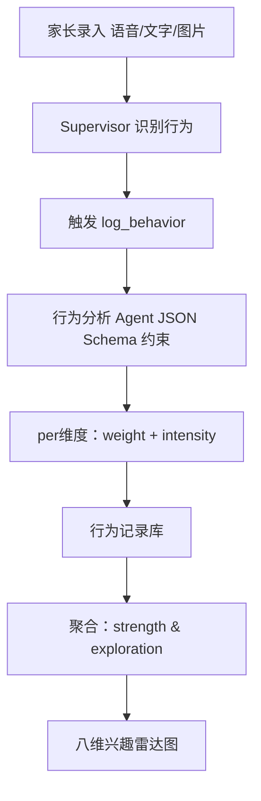
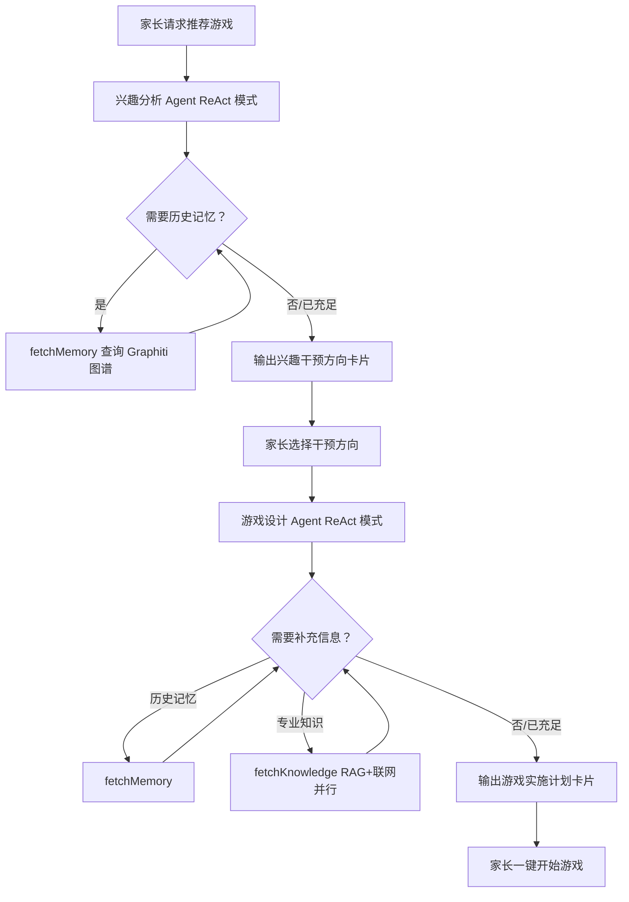
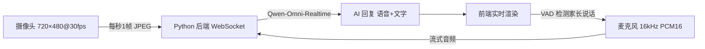
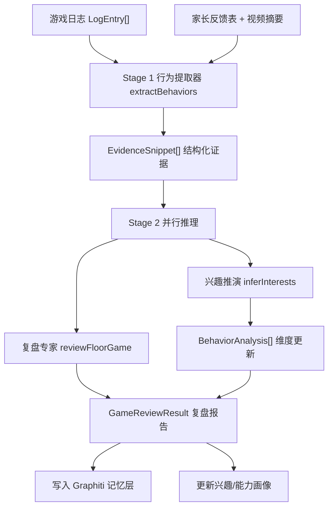

# 核心功能

## 挖掘刻板行为

孤独症儿童的重复性行为往往携带其感知偏好的信号，是制定个性化干预方案的关键依据。系统将行为观察转化为可量化的兴趣画像，支撑后续游戏推荐决策。

### 多模态行为录入

家长可通过三种方式随时记录孩子行为：**语音**（阿里云 NLS 实时转录）、**文字描述**（Supervisor 自动识别并触发分析）、**图片/视频**（Qwen-VL 多模态模型提取行为特征）。

### 八维兴趣框架

维度体系基于 DIR/Floortime 临床理论对儿童感知-运动发展的系统分类，覆盖感知通道与认知-社交两大领域，共八个维度：

| 维度 | 描述 |
|---|---|
| Visual（视觉） | 颜色、形状、光线、视觉追踪 |
| Auditory（听觉） | 声音、音乐、节奏、音调 |
| Tactile（触觉） | 材质、温度、触压感知 |
| Motor（运动） | 大肢体运动、平衡、空间移动 |
| Construction（建构） | 拼搭、组合、构造物理结构 |
| Order（秩序） | 规律、排列、分类、一致性 |
| Cognitive（认知） | 因果关系、规则、问题解决 |
| Social（社交） | 互动、模仿、关注他人反应 |

### 量化分析机制

行为分析 Agent 对录入描述进行解析，输出各相关维度的双指标（仅纳入关联度 ≥ 0.4 的维度）：

- **weight**（0.4–1.0）：行为与该维度的关联程度
- **intensity**（−1.0 ~ +1.0）：正值为主动参与，负值为回避抵触

输出格式由 JSON Schema 强制约束，每个维度附推理说明，避免 LLM 自由输出导致的不可控偏差。

随行为记录累积，系统对各维度做加权聚合：

```
strength   = Σ(intensity × weight) / Σ(weight)，归一化至 0–100
exploration = Σ(weight) 归一化至 0–100，反映该维度的观察频次与丰富程度
```



### 三种干预模式

基于 strength 与 exploration，系统自动将各维度归入三类：

| 模式 | 判定条件 | 策略 |
|---|---|---|
| **利用（Leverage）** | strength ≥ 60 | 以该维度为切入点设计游戏 |
| **探索（Explore）** | 40 ≤ strength < 60，exploration < 50 | 低压力活动拓展接受边界 |
| **避免（Avoid）** | strength < 40 | 暂时规避，降低焦虑风险 |

结果以双轴雷达图呈现，strength 与 exploration 各对应一层轴线，构成孩子当前兴趣结构的量化基础，直接驱动后续游戏推荐。

---

## 地板游戏设计

游戏设计采用两阶段工作流，在 AI 分析与家长决策之间设置显式交互节点，避免全自动化推荐忽视家长对孩子当下状态的判断。

### 阶段一：兴趣综合分析

触发时机为家长请求推荐游戏。兴趣分析 Agent 以 ReAct 模式运行，输入当前八维度指标与孩子档案，自主决定是否调用 `fetchMemory` 补充历史记忆（最多 2 次），随后输出**兴趣干预方向卡片**，内容包含：

- 各维度的 strength / exploration 评分及 leverage / explore / avoid 分类
- 3–5 条干预建议，每条注明目标维度、策略类型与示例活动

卡片以交互组件形式渲染在对话气泡中，家长可直接选择建议或指定偏好方向，结果写入 `sessionStorage` 传递至下一阶段。

### 阶段二：游戏方案生成

家长确认干预方向后，游戏设计 Agent 接收目标维度、策略类型与家长偏好（场地、时长、特殊要求），以 ReAct 模式自主检索：

- `fetchMemory`：查询孩子历史游戏反应与有效策略
- `fetchKnowledge`：并行调用 RAG 专业知识库 + 博查联网搜索，获取 DIR 游戏设计方法与案例

信息充足后输出**游戏实施计划卡片**，包含游戏名称、干预目标、所需材料及 4–6 个步骤（每步含家长操作指引与互动要点）。


## 地板游戏实时引导

游戏执行阶段面临两个核心问题：家长需要同时关注孩子、执行步骤并记录观察，认知负担极高；且传统文字指南无法应对游戏中涌现的突发情况。系统通过图文引导与实时 AI 陪同两条线并行解决上述问题。

### 步骤引导图异步生成

游戏卡片确认后，系统立即在后台为每个步骤调用 DashScope wanx2.1 文生图模型，生成儿童绘本风格的亲子互动示意图。整个生成流程完全异步：提交任务后立即返回，前端以 3 秒间隔轮询任务状态，图片生成完成后下载并以 Base64 写入 IndexedDB。主线程不等待、不阻塞，家长进入游戏页面时图片往往已就绪，每个步骤均有对应的可视化示意图。

### 多模态实时 AI 引导

系统集成 **Qwen-Omni-Realtime** 多模态实时通话能力，以 AI 干预顾问身份全程陪同游戏执行。

**音视频采集**：前端通过 `getUserMedia` 采集摄像头画面（720×480，30fps），每秒截取一帧编码为 JPEG 发送给 AI；麦克风以 16kHz PCM16 格式实时采集，经 WebSocket 流式传输至后端。

**语音交互**：内置 VAD（语音活动检测），家长开口时立即暂停 AI 音频播放，支持随时打断。AI 以语音 + 文字双通道实时回复，对话记录自动写入当次游戏数据。

**上下文感知**：通话建立前，系统自动聚合孩子完整画像注入系统提示词，包含：孩子基本信息与诊断、八维兴趣分布与六维 DIR 能力评分、当前游戏标题/目标/分步骤指引、近期有效策略与挑战领域。AI 因此能在观察到孩子行为时即时给出针对该孩子特点的引导建议，而非通用指令。



### 快捷行为记录

游戏界面提供快捷按钮，家长单击即可将当前观察到的孩子行为推送至行为分析 Agent，无需切换页面，行为数据实时写入兴趣画像，为下次游戏推荐提供依据。
## 游戏复盘

游戏结束后，系统汇聚三路证据来源，经两阶段分析流水线生成结构化复盘报告。

### 三路证据来源

**游戏内记录（LogEntry[]）**：游戏过程中家长通过快捷按钮录入的行为片段和语音备注，自动附带时间戳。

**家长反馈表**：游戏结束后引导家长填写五项结构化问题，覆盖共同注意、沟通循环、情绪调节、互动随手记、AI 引导建议评价，输出格式化文本供 Agent 消费。

**AI 视频分析**：家长可上传游戏录像，系统调用 Qwen-VL 多模态模型进行分析，重点提取眼神对视频率、共享注意持续时长、肢体互动方式与情绪状态变化时间点，生成结构化视频摘要注入复盘上下文。视频分析与反馈表提交并行执行，不阻塞主流程。

### 两阶段分析流水线



**Stage 1** 将三路原始输入统一提炼为 `EvidenceSnippet[]`，屏蔽来源差异，为后续 Agent 提供一致的输入格式。

**Stage 2** 并行调用两个专家 Agent：
- **兴趣推演 Agent**：从行为证据中推断维度变化，更新孩子兴趣画像
- **游戏复盘 Agent**：以 DIR/Floortime 专家视角对本次游戏进行全面评价，启动前拉取 Graphiti 图谱中该孩子的历史互动记忆（最多 10 条），使评价具备跨游戏的纵向视角

### 复盘报告结构

复盘 Agent 输出 `GameReviewResult`，包含八个维度的量化评分与下一步决策建议：

| 评分维度 | 说明 |
|---|---|
| 孩子参与度 | 主动投入程度与持续时长 |
| 游戏完成度 | 步骤执行的完整性 |
| 情感连接 | 亲子间情绪同频与回应质量 |
| 沟通互动 | 双向沟通循环的建立数量 |
| 能力进步 | 目标维度能力的可见变化 |
| 家长执行质量 | 引导策略与 DIR 原则的契合度 |
| 反馈质量 | 家长对孩子信号的回应及时性 |
| 探索广度 | 本次游戏中新行为的出现比例 |

最终给出三选一决策建议（**继续此游戏 / 建议调整 / 建议避免**）及具体改进方向，供家长和下次游戏推荐直接参考。复盘结果异步写入 Graphiti 图谱，成为后续 Agent 可检索的长期记忆。
## 成长日历

系统将所有干预数据汇入统一的时间视图，让家长在任一维度查看孩子的成长轨迹，而不是在多个散落页面之间来回切换。

### 三层日历视图

**周视图**（默认）：以当前周为中心，每天显示行为记录和完成游戏的事件标记。支持左右滑动（触摸与鼠标拖拽均可）切换上下周，切换时附带物理惯性动画。有事件的日期以色点标注，一眼可辨哪些天有干预记录。

**月历视图**：可展开为完整月历网格，42 格视图补全上下月边缘日期，宏观呈现干预活动在整月的分布密度。

**时间轴视图**：点击任意日期，下方展开当天的事件时间轴，行为记录与游戏活动按 `dtstart` 时间戳排序，游戏条目显示完整时段（开始时间 → 结束时间）及持续时长；行为记录可点击展开详情，查看维度映射与推理说明。

### 数据来源整合

日历直接读取两个存储服务的实时数据，无需额外同步：

- `behaviorStorageService`：所有行为记录（含时间戳、维度匹配、推理说明）
- `floorGameStorageService`：状态为 `completed` 的游戏（含 `dtstart` / `dtend` 完整时间段）

### 兴趣成长曲线

日历页面配套兴趣雷达图的时间轴版本。系统按日期对行为记录做累计聚合，生成 `TimelineDataPoint[]`——每个数据点对应一个有记录的日期，存储截至该日期的八维累计强度与探索度。家长可以拖动时间轴滑块，观察八维兴趣雷达图随时间的演变过程，量化孩子在不同干预阶段的成长变化。
## AR 增强地板游戏

传统地板时光游戏依赖物理道具，准备成本高、场地受限，且难以制造对孤独症儿童具有吸引力的高感知刺激。系统将 AR 技术引入干预场景，在真实家庭空间中叠加虚拟互动元素，降低道具门槛的同时，为多种兴趣维度的干预提供更丰富的感知通道。

### 共享 AR 空间与共同注意训练

家长与孩子通过设备摄像头共享同一 AR 视野，在真实环境中协作完成虚拟任务。以"3D 涂鸦"场景为例：孩子在空中手势绘制彩色线条，家长接续绘制，共同完成一个图案；完成时触发虚拟烟花或音效反馈。整个过程的核心干预目标是**共同注意**与**双向沟通循环**——孩子必须关注家长的操作才能接续，家长的回应也必须跟随孩子的引领，与 DIR/Floortime 的"跟随孩子"原则高度契合。

### 按兴趣维度定制的 AR 场景

AR 游戏库基于八维兴趣画像动态适配，不同维度对应不同场景设计：

| 目标维度 | AR 场景 | 干预机制 |
|---|---|---|
| Visual（视觉） | 虚拟彩色图案生成 | 色彩追踪与视觉共享注意 |
| Auditory（听觉） | 空间音乐按钮 | 触发式因果音效反馈 |
| Tactile（触觉） | 虚拟动物抚摸互动 | 手势接触模拟触觉反馈 |
| Social（社交） | 接力涂鸦、协作拼图 | 强制建立双向互动回合 |
| Cognitive（认知） | 虚拟动物喂食规则 | 因果关系与规则认知 |

### 与现有系统的整合

AR 游戏在系统中以 `isVR: true` 标记存入游戏库，与普通地板游戏共享同一套流程：兴趣分析 → 游戏设计 → 实时引导 → 游戏复盘。游戏过程中的行为数据同样写入兴趣画像和 Graphiti 记忆层，复盘结果可供后续推荐参考。所有 AR 渲染在本地设备完成，不上传视频流，保护家庭隐私。
